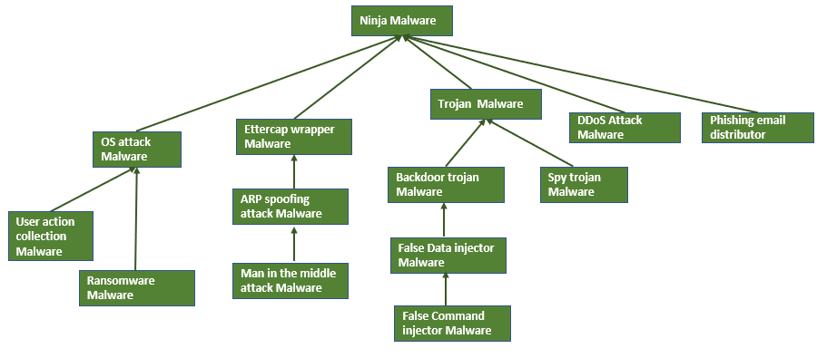

# Project Ninja-Malware System

The project Ninja is a centralized controlled distributed cyber attack launching emulation system. 

[TOC]

------

### Introduction 

The idea of the project name comes from a Japanese comic book "Naruto", this project offers various groups of centralized controlled "Ninja" malware designed for launching cyber attacks on specific targets. The reason why we call our software this name is because below feature: 

1.  **Polymorphism malware** : In the realm of Ninjas, each individual possesses fundamental skills like infiltration, complemented by specific specialties such as information gathering or assassination. Our system mirrors this concept, where all Ninja malwares inherit core functionalities from basic Ninja malware. The basic malware execute fundamental malicious actions like running commands, stealing files, and injecting malware onto the victim. Additionally, each advanced Ninja malware integrates with specialized modules for specific tasks, such as Modbus-FDI, Man-in-the-Middle (MITM) attacks, ARP spoofing, and system compromise. This modular approach enables the Ninjas to adapt and execute a diverse range of malicious actions tailored to particular objectives.
2. **Centralized control and task distribution** : In every Ninja village, a shadow leader is responsible for task assignment to all other Ninjas. Similarly, in our system, the hacker assumes the role of the leader, leveraging a centralized controlled RTC2 (Red Team Command and Control) system. Through this system, the hacker can seamlessly allocate tasks to any of the "Ninja" via the bulletin board. The Ninjas, represented by malware entities, retrieve their tasks from the bulletin board and subsequently report the results of their task execution back to the same interface. All communications within this system are encrypted, ensuring secure transmission of information. The shadow leader can assign tasks from any location on the internet, and due to the indirect communication approach, even if defenders attempt to trace the communication, they would only be led to the bulletin board and not the direct interaction between the hacker and the malware.
3. **Dynamic malware action code execution** :   The Ninja possesses an arsenal of diverse weapons, and our system facilitates a dynamic attack action repository that allows for real-time integration. Hackers can seamlessly attach attack modules to tasks via the bulletin board. When a Ninja receives a task, it automatically equips the assigned attack module, enabling it to perform the specified attack action. For instance, a spy-trojan Ninja, designed for collecting credentials, can be enhanced with additional capabilities. If the hacker assigns a False Data Injection(FDI) task to it, the Ninja will dynamically download the necessary modules, such as the network scan module and Modbus-FDI module, transforming itself into an adept FDI attack program. This modular approach ensures adaptability and precision in executing a wide range of attack actions based on task assignments.
4.  **Camouflage action and erase trace** : Upon completion of a task, the Ninja efficiently erases any traces of its activities. The tasks assigned to the Ninja are saved the in the memory as a linked list, there is no code based tasks line and the malware only keep the pointer to the current task. For example if a Ninja got 4 tasks to break a system, when the Ninja malware finished the tasks and break the system, all the tasks data will be removed from the program execution memory the data store parameters will be cleared, so even the the defender detected error and "catch" the Ninja program, from the memory dump they will not able to reconstruct the tasks list from program or from the memory dump. 
5. **Malware self protection** : Engaging in a strategic confrontation with defenders, each Ninja is paired with a Ninja-dog, functioning as a program protection watchdog. If the Ninja malware is killed/deleted by the anti malware program or the user, the Ninja-dog will recover the Ninja malware automatically. At the same time if a Ninja detected it is recovered from a Ninja-dog, it will start a sub process to active the self protection feature: lock the victim's mouse+keyboard input, freeze screen and start to use garbage to full fill the memory to cause a slowdown in the system's performance. These defensive mechanisms enhance the resilience and adaptability of the Ninjas in the face of countermeasures initiated by defenders.

The project contents 3 sub projects: 

- **Ninja malware family** : The actual malicious action generation program with different build in attack functions. 
- **RTC2(Red Team Command&Control) bulletin board** : The control hub to link all the malwares and the hacker for attack task post, synchronize, accept and execution result feed back.   
- **Malicious action module repository** : the weapon repository which can be plugged in the malware to extend the malware's destructiveness and do special attack tasks.

------

### Ninja malware family

The current Ninja malware family tree is shown below, every "child" malware will inherit all the attack function from its "parent" and add the special attack tasks attack module.

Malicious action program function introduction

#### Basic malicious action program

> **Ninja Malware** function: 
>
> - Run command on victim
> - Steal file from Victim to RTC2 
> - Inject other malware from RTC2 to victim node

#### OS Attack Malware program

> **OS Attack Malware** function: 
>
> - All the Ninja Malware's function
> - Victim computer memory full filled function. 
> - Victim computer keyboard and mouse freeze.
>
> **User action collection malware** function:
>
> - All the OS Attack Malware function
> - User command history collection function. 
> - User keyboard type in logging function
>
> **Ransomware malware** function: 
>
> - All the OS Attack Malware function
> - User file encryption function. 
> - User desktop screen shot function. 
> - User camera record function.

#### Ettercap Wrapper Malware program

> **Ettercap wrapper** function:
>
> - All the Ninja Malware's function
> - ARP poisoning attack function.
>
> **ARP spoofing attacker** function:
>
> - All the Ettercap wrapper's function
> - Network traffic mirroring function. 
> - Network packet drop and lock function 
>
> **MITM attacker** function:
>
> - All the ARP spoofing attacker function
> - MITM packet data filtering and modification function

#### Trojan Malware program

> **Trojan Malware** function:
>
> - All the Ninja Malware's function
> - Victim node subnet scan function
> - Credential files searching function
>
> **Spy trojan malware** function: 
>
> - All the Trojan Malware's function
> - User desktop screen shot function. 
> - User keyboard input logging and type in simulation function 
> - User credential (username, password ) record function 
>
> **Backdoor Trojan Malware** function
>
> - All the Trojan Malware's function 
> - Victim node's network interface traffic mirroring function
> - SSH connection, reverse SSH, SCP, SSH port forwarding.
> - UDP server backdoor function and port bind function. 
>
> **False data Injection malware** function: 
>
> - All the Backdoor Trojan Malware's function 
> - Modbus data fetching function. 
> - High frequency holding register data overwrite function. 
>
> **False Command Injection malware** function: 
>
> - All the False data Injection malware's function
> - Fake PLC memory and coil setting command inject function

#### DDoS attacker malware 

> **DDoS attacker** function: 
>
> - All the Ninja Malware's function
> - DDoS attack function

#### Phishing email generate malware

> **Phishing email distributo**r function : 
>
> - All the Ninja Malware's function
> - Phishing email contents generate function. 
> - Phishing email deployment function 

------

### RTC2(Red Team Command&Control) bulletin board 

The Red Team Command and Control (RTC2) server, commonly known as a C&C server, plays a pivotal role in cyber exercises and ranges. It serves as a centralized hub that red team members use to control and communicate with simulated compromised victims. This command center enables red team members or attackers to seamlessly issue instructions to the compromised machines, collect data from them, and coordinate various malicious activities within the exercise program. Our goal is to offer a comprehensive C2 server emulation solution designed for cyber exercise red team members. This solution allows them to seamlessly integrate different probing programs and malicious action programs, providing dynamic monitoring, scheduling, and control capabilities. The versatility of our solution makes it applicable across a range of fields, offering a robust platform for enhancing cyber defense readiness and testing the resilience of security measures.

------

### Malicious action module repository 

We provide a malicious action modules repository which includes 18 general malicious action under 8 attack vectors. The  malicious action modules are the "weapons"  can be integrated in the malware via program code base or dynamically plug in the ninja malware and run in sub process.

 The malicious action modules is shown below:

| Idx  | Attack Vector                 | Malicious action modules                                     |
| ---- | ----------------------------- | ------------------------------------------------------------ |
| 1    | Compromised Credentials       | File stolen, critical data leakage/capture, history scanning, keyboard input logging, screen shot capture, browser cookie archiving. |
| 2    | Weak Credentials              | Password dictionary crack attack ( zip file )                |
| 3    | Phishing                      | Phishing email generation, scam email generation.            |
| 4    | Brute Force                   | Web account login brute force crack and takeover.            |
| 5    | Distributed Denial of Service | DDoS attack on web, OT-system(PLC), different service ( such as email server ). |
| 6    | Trojans                       | Backdoor trojan, spy trojan                                  |
| 7    | Man-in-the-Middle Attacks     | Arp spoofing , traffic block , packets drop, packets data replacement. |
| 8    | Insider threats               | Malware camouflage, Malicious(code/program) inject, device I/O Compromise (mouse, keyboard, screen frozen), malware process protection watchdog. |

------

>  Last edit by LiuYuancheng (liu_yuan_cheng@hotmail.com) at 30/01/2024, if you have any problem please free to message me.