# Backdoor Trojan System

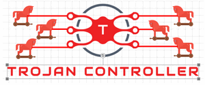

We want to build a backdoor trojan system which contents a watch dog protected backdoor trojan, a peer to peer single trojan controller and a multiple trojans control hub system for below purposes :

1. **Education** for any level of cyber security course about trojan or the related course lab assignment / demo. 
2. **Training** for company employees, semi-professionals such as the workshop about the trojan attack and defense. 
3. **Development or cluster management** for cluster admin to remote manage cloud computing infra (with out using credentials ) such as do program hot update or software deployment.
4. **Testing** for the security solution program / malware detection program to detect the trojan.
5. **Research** in cluster network unusual/exception traffic detection, trojan detection, risk respond,  penetration action detection.

[TOC]

------

### Introduction

The Trojan system contents 3 main programs:

1. One **Backdoor Trojan** program running on victim open a backdoor to allow hacker to remote run commands, steal credential files, do harmful action to the host computer or  insert other malware into a host without authorization. 
2. One **P2P Trojan Connector**  which is a console based peer to peer direct trojan remote connector for hacker used to remote control one of the backdoor trojan to do the harmful action such as rename all user's file, full fill user's home folder with garbage files. It allows multiple hackers to control one trojan at the same time. 
3. One **Trojans Controller Hub** which is a UI based trojan management hub used for hacker to manage multiple trojan in different victim host or batch launch attack such as clear all files in every victim computer's home folder. It allows one hacker control multiple trojans at the same time.

The system relation diagram is shown below:

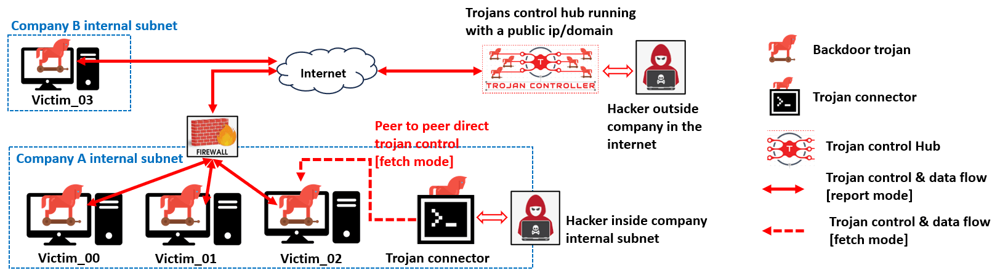

`version v0.1.2`


------

### Program Design

This session will introduce the detail design of Backdoor Trojan, P2p Trojan Connector, Trojans Controller Hub. 

#### Backdoor Trojan

The backdoor trojan program contents four main parts: 

- A process watch dog protector to protect itself to avoid user stop the trojan by killing its process. 
- A function actor implement detailed hacker's tasks such as run command, execute harmful action, do files transfer and malware injection, log user's keyboard input.
- A UDP server to handle the remote control request from Trojan connector and send back the tasks execute result. 
- A UDP client to report to Trojan control hub,  pull down the tasks assigned to it from the hub and report the tasks execution result back to hub.

The backdoor trojan will be under "silent mode" before a hacker uses valid active code to active the trojan, : before active the trojan will not response to any request to the victim machine, so the network security people will not find the backdoor service if they Nmap scan the victim’s network service. 

The backdoor trojan program work flow is shown below:

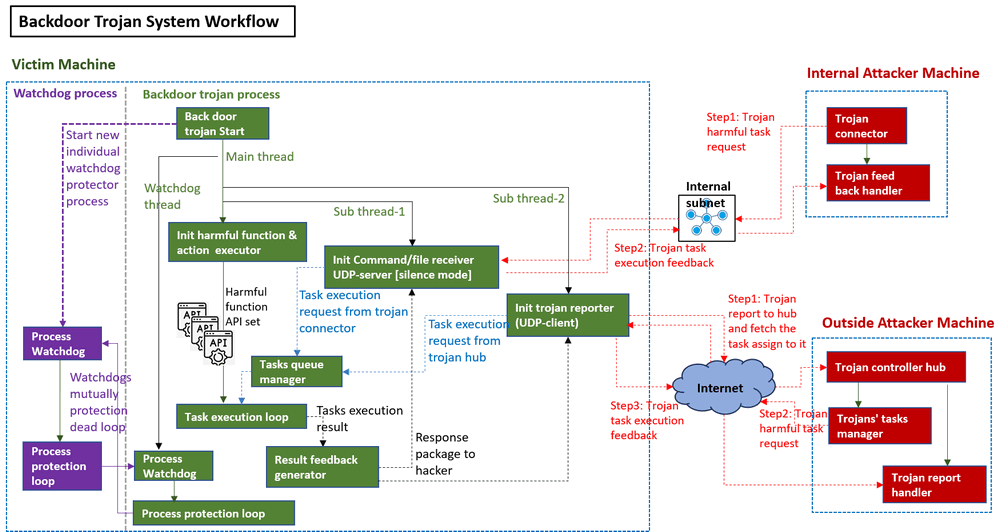

The backdoor trojan is a multi-process program with multiple threads running parallel, these are the four thread detail:

1. Program main thread : the main thread will call the task manager to call different task handling API to finish the harmful tasks.
2. Watchdog thread : A thread to check the new started watchdog's execution. 
3. Task receiver thread : A thread with UDP server to accept the trojan connector's request, put the task in the queue and send the task execution result back to the hacker. 
4. Trojan reporter thread: A thread with UDP client to register the trojan to the trojan control hub, fetch the task regularly from the hub, then update the task execution result to the trojan controller hub.

##### Watch dog process

The backdoor trojan will start a in an individual process to run the watchdog program (watchdog-A) and a watchdog thread (watchdog-B) in itself to regularly check the watchdog-A's execution, if the watch dog program is killed by anti-malware or the user, it will start a new watchdog protector. The watchdog protector will do the same thing for the trojan (if the watchdog detected the trojan is killed, the will restart a new backdoor trojan). These 2 programs will make a protection deadlock loop as shown below:

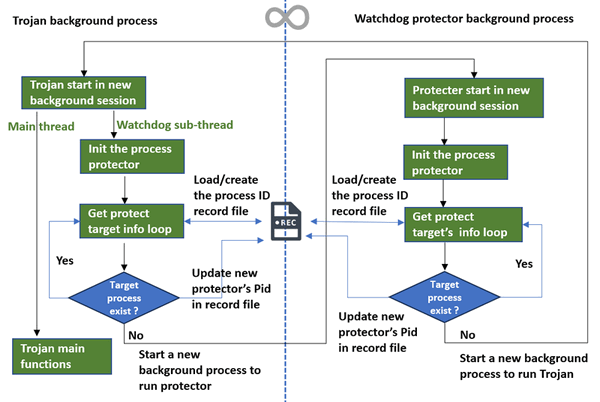

Unless the user can kill the trojan and the watchdog protector processes at the same time, otherwise he can not stop the trojan running( by only kill the trojan process ).


#### P2P Trojan Connector

The P2P Trojan connector is a console based peer to peer direct connection program for hacker to remote control the backdoor trojan to do the harmful action on victim machine such as renaming all user's file, full filling user's home folder with garbage files or inject other malware in to the victim... It supports multiple hackers work together to control one victim machine. As it needs to send the handshake to the target trojan, so the connector need to be in the same subnet of the victim host ( If there is no additional routing rule ) .

The Trojan and multiple trojan connector timing UML diagram is shown below:

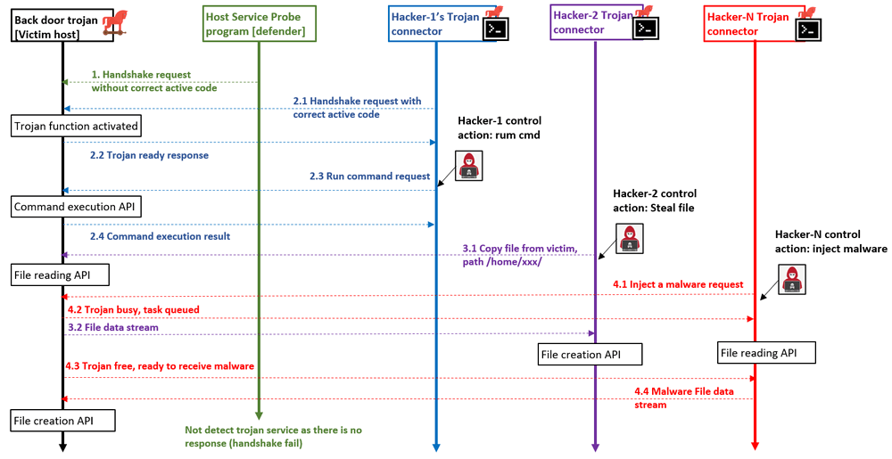

**Communication message example:**

1- Communicate hand hake : 

| Action sequence in diagram | From            | to              | Message example |
| -------------------------- | --------------- | --------------- | --------------- |
| 2.1 Active trojan          | connector       | backdoor trojan | `<ACTIVECODE>`  |
| 2.2 Trojan repose ready    | backdoor trojan | connector       | `ready`         |

2 - Execute a command : 

| Action sequence in diagram | From            | to              | Message example                      |
| -------------------------- | --------------- | --------------- | ------------------------------------ |
| 2.3  Run command request   | connector       | backdoor trojan | `CMD;detail;<cmd>` / `CMD;run;<cmd>` |
| 2.4 Command execute result | backdoor trojan | connector       | `<command execution result>`         |

3 - Steal a file : 

| Action sequence in diagram  | From            | to              | Message example               |
| --------------------------- | --------------- | --------------- | ----------------------------- |
| 3.1 Copy a file from victim | connector       | backdoor trojan | `FIO;out;<filepat_in_victim>` |
| 3.2 File data stream        | backdoor trojan | connector       | `<file binary data>`          |

4 - Inject a file : 

| Action sequence in diagram  | From            | to              | Message example                      |
| --------------------------- | --------------- | --------------- | ------------------------------------ |
| 4.1 Inject a file to victim | connector       | backdoor trojan | `FIO;<file Name>;<file binary data>` |
| Injection response          | backdoor trojan | connector       | `done` / `error`                     |

As the trojan's tasks execution is single thread, when the trojan is executing a task, the new incoming tasks request from hackers will be put the in the tasks queue. When a hacker runs the connector to connect a trojan at the 1st time, he needs to type in a valid active code to disable the trojan's silent mode, then he can select the harmful action he wants the trojan do :

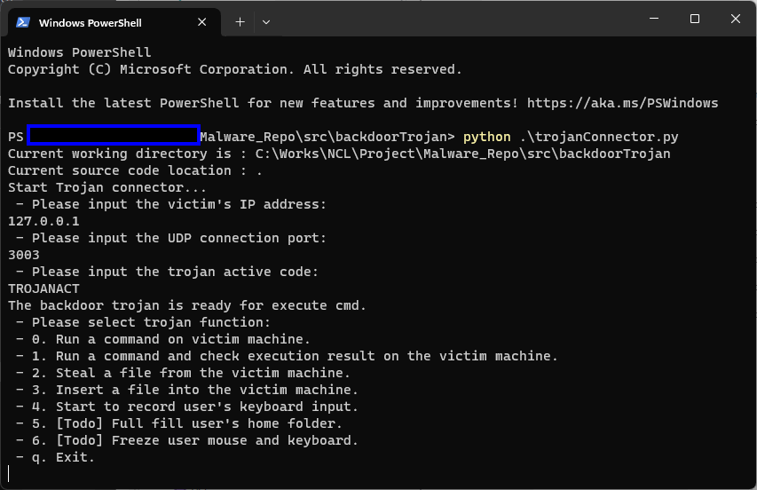

The function 5 & 6 is under development, we will make then online at version v0.1.3.


#### Trojans Controller Hub

Trojans Controller Hub allows one hacker control multiple trojans, it will provide UI management interface for hacker to manage multiple trojan in different victim hosts to batch launch attack such as clear all file in every victim computer's home folder. If a backdoor trojan's `report mode` flag is set to true, it will try to register itself to the Trojans Controller Hub regularly in low frequency. Once registration accepted, the trojan will repeat fetch task from the tasks from hub to execute under higher frequency. 

The Trojans and trojan controller hub timing UML diagram is shown below:

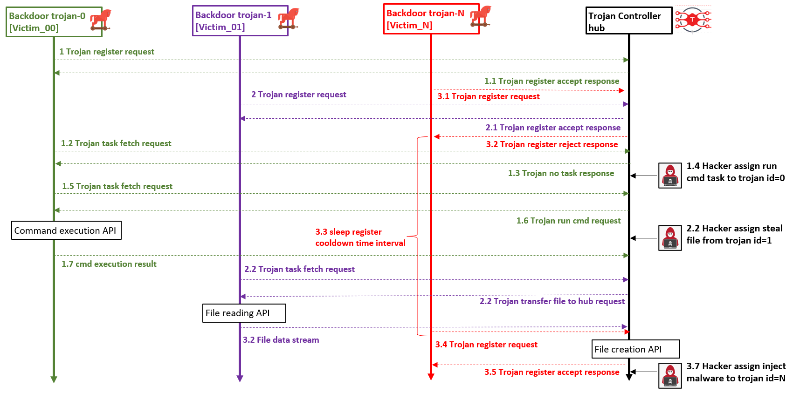

**Communication message example:**

1- Communicate hand hake : 

| Action sequence in diagram      | From            | to              | Message example            |
| ------------------------------- | --------------- | --------------- | -------------------------- |
| 1.0 Trojan register             | backdoor trojan | control hub     | `RPT;Rigister;<Trojan_ID>` |
| 1.1 Control-hub accept register | control hub     | backdoor trojan | `CON;accept;ready`         |

2 - Fetch assigned task : 

| Action sequence in diagram       | From            | to              | Message example         |
| -------------------------------- | --------------- | --------------- | ----------------------- |
| 1.1 Trojan fetch tasks request   | backdoor trojan | control hub     | `RPT;Ready;<Trojan_ID>` |
| 1.3 Control-hub response no task | control hub     | backdoor trojan | `CON;accept;ready`      |

3 - Fetch a command execution task :

| Action sequence in diagram         | From            | to              | Message example             |
| ---------------------------------- | --------------- | --------------- | --------------------------- |
| 1.5 Trojan fetch tasks request     | backdoor trojan | control hub     | `RPT;Ready;<Trojan_ID>`     |
| 1.6 Control-hub response exe cmd   | control hub     | backdoor trojan | `CMD;detail;<command line>` |
| 1.7 Command execution result       | backdoor trojan | control hub     | `<result>`                  |
| Control-hub response accept result | control hub     | backdoor trojan | `CON;accept;ready`          |

4 - Fetch a file transfer tasks :

| Action sequence in diagram          | From            | to              | Message example              |
| ----------------------------------- | --------------- | --------------- | ---------------------------- |
| 2.1 Trojan fetch tasks request      | backdoor trojan | control hub     | `RPT;Ready;<Trojan_ID>`      |
| 2.2 Control-hub response fetch file | control hub     | backdoor trojan | `FIO;out;<Victim_file_path>` |
| 2.3 File data stream                | backdoor trojan | control hub     | `FIO;out;<file_binary_data>` |
| Control-hub response accept result  | control hub     | backdoor trojan | `CON;accept;ready`           |

5 - Inject a file to victim task : 

| Action sequence in diagram       | From            | to              | Message example                     |
| -------------------------------- | --------------- | --------------- | ----------------------------------- |
| Trojan fetch tasks request       | backdoor trojan | control hub     | `RPT;Ready;<Trojan_ID>`             |
| Control-hub response inject file | control hub     | backdoor trojan | `FIO;<filename>;<file_binary_data>` |

Trojan control hub UI view:

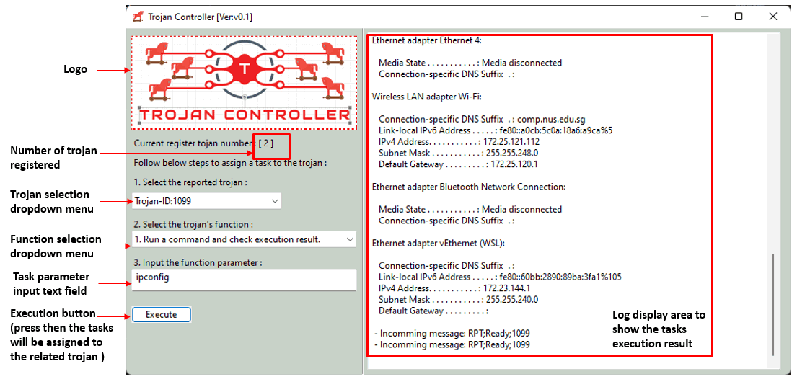

Run the windows cmd `ipconfig` on victim host which "Trojan-ID:1099".


------

### Program Setup

This session will introduce the setup steps of Backdoor Trojan, P2p Trojan Connector, Trojans Controller Hub on each host:

##### Setup Backdoor Trojan

Development/Execution Environment : python 3.7.4+

Additional Lib/Software Need: N.A 

Program Files List (To run the backdoor trojan, all the files need to be in same folder) : 

| Program File                | Execution Env | Description                                                  |
| --------------------------- | ------------- | ------------------------------------------------------------ |
| src/backdoorTrojan.py       | python 3      | The backdoor trojan main program.                            |
| src/backdoorTrojanGlobal.py | python 3      | Module to store all the global variable.                     |
| src/backdoorTrojanMgr.py    | python 3      | Module to provide different function for the trojan to finish the tasks which hacker required |
| src/ConfigLoader.py         | python 3      | Module to load the config file.                              |
| src/udpCom.py               | python 3      | Library module to provide UDP communication (server/client)  |
| src/trojanConfig.txt        |               | Config file to dynamic change the trojan setting.            |


##### Setup P2P Trojan Connector

Development/Execution Environment : python 3.7.4+

Additional Lib/Software Need: N.A 

Program Files List (To run the P2P trojan connector, all the files need to be in same folder) : 

| Program File           | Execution Env | Description                                                 |
| ---------------------- | ------------- | ----------------------------------------------------------- |
| src/trojanConnector.py | python 3      | The trojan connector main program.                          |
| src/udpCom.py          | python 3      | Library module to provide UDP communication (server/client) |


##### Setup Trojan Control Hub

Development/Execution Environment : python 3.7.4+

Additional Lib/Software Need: 

- **wxPython** : https://docs.wxpython.org/index.html , Install : `pip install wxPython`

Program Files List (To run the P2P trojan connector, all the files need to be in same folder) : 

| Program File                | Execution Env | Description                                                  |
| --------------------------- | ------------- | ------------------------------------------------------------ |
| src/trojanReceiver.py       | python 3      | The trojan control hub main program.                         |
| src/trojanReceiverGlobal.py | python 3      | Module to store all the global variable.                     |
| src/trojanReceiverMgr.py    | python 3      | The manager module to handle the trojan's report and  send the hacker's tasks request the related trojan. |
| src/udpCom.py               | python 3      | Library module to provide UDP communication (server/client)  |


------

### Program Usage

This section will introduce how to usage each program

##### Run Backdoor Trojan

Follow the setup section to copy all the file, open the config file and change the parameters:

```
# This is the config file template for the module <TrainCtrlRun.py>
# Setup the paramter with below format (every line follows <key>:<val> format, the
# key can not be changed):

# Init the own ID, if don't set the trojan will auto generate a random one. 
OWN_ID:1099

# The tojan active code, remove this line the trojan will be always active mode.
ACT_CODE:TROJANACT

# Define the UDP host port here:
UDP_PORT:3003

# Init the trojan report here:
# - report mode flag:
RPT_MD:True
# - trojan control hub public IP and port
RPT_IP:112.20.102.101
RPT_PORT:3004
```

Run the backdoor trojan program: 

```
python3 backdoorTrojan.py
```


##### Run P2P Trojan Connector 

Run connector program: 

```
python3 trojanConnector.py
```

Type in the trojan's IP address, port number and active code as shown below:


If the trojan accepted your connection request, the function list will show up. 

Now if the hacker want to check if whether there is a user is using the victim machine, he can select the function [1] and run the user list command `net user` as shown below:

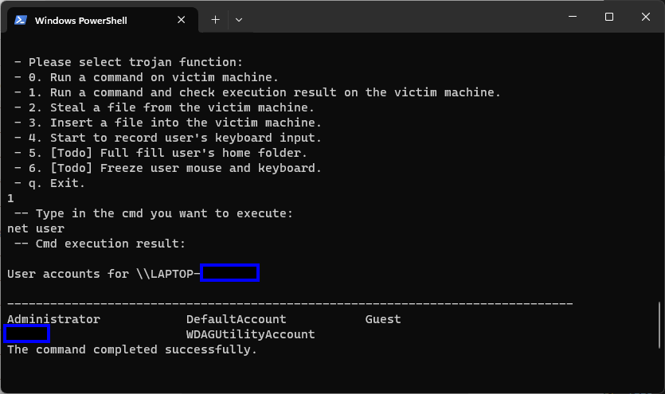

If the hacker wants to steal a file from the victim, select function [2], then type in the file path (need to the a absolute file path) , if the file exist, then it will be transferred to the same folder of the trojan connector.

If the hacker wants to inject another malware such as the screen freezer to the victim, select function [3] , the type in the malware file path (in hacker's local computer), then the malware will be transferred to the same folder of the backdoor trojan.


##### Run Trojan Control Hub

Run trojan control hub program: 

```
python3 trojanReceiver.py
```

When a new trojan try to register to the control hub, you can see the register message and the reported trojan number will increase, then the hacker can select the trojan he wants to control in the drop down menu. (As shown below)

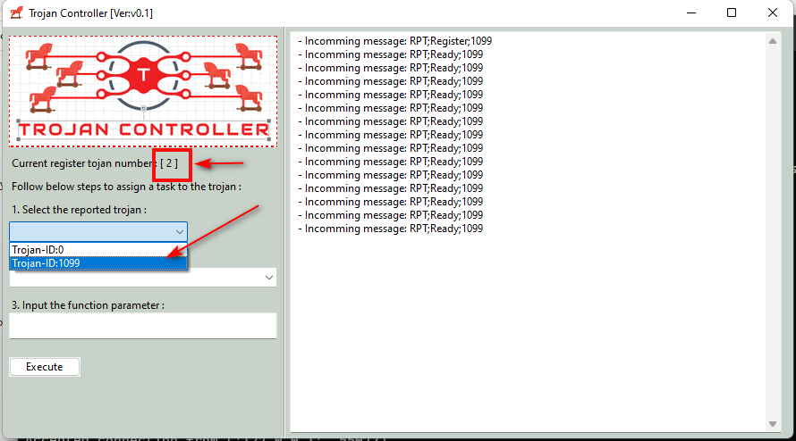

To assign a task to the trojan, select the task function in the function selection drop down menu, then input the parameter: 

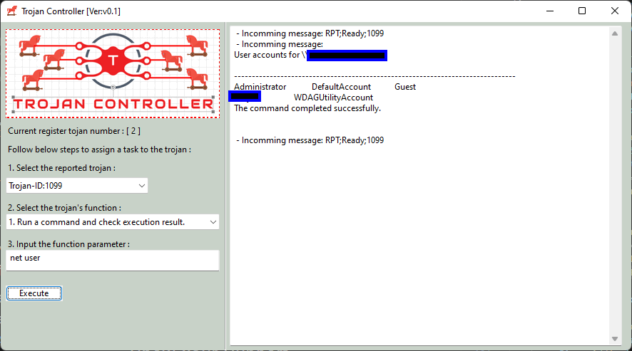

Then click the "execute" button, the task will be assigned to the related trojan, after the tasks is finished execute, the result will be shown in the right log area.

If the hacker wants to steal a file from the victim, select function [2], then type in the file path (need to the a absolute file path) in the function parameter text field, then it will be transferred to the same folder of the trojan connector.

If the hacker wants to inject another malware such as the screen freezer to the victim, select function [3] , the type in the malware file path (in hacker's local computer)  in the function parameter text field, then the malware will be transferred to the same folder of the backdoor trojan.


------

#### Problem and Solution

Refer to `doc/ProblemAndSolution.md`


------

> Last edit by LiuYuancheng(liu_yuan_cheng@hotmail.com) at 29/10/2023, if you have any problem, please send me a message. 