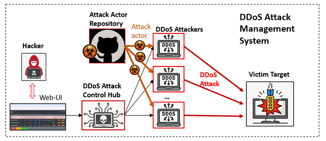
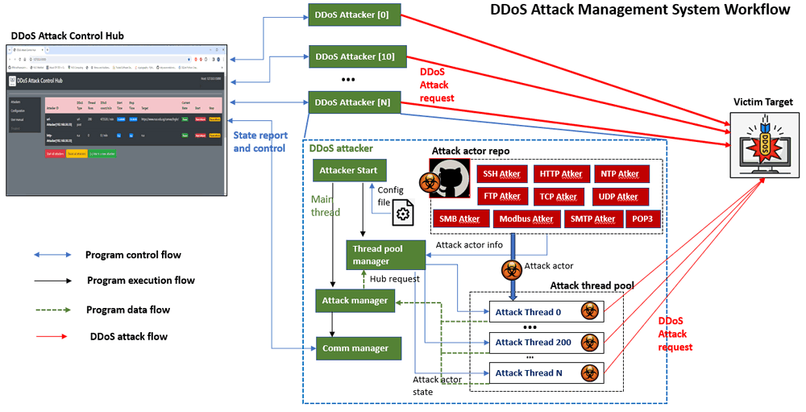
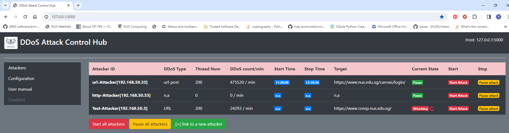
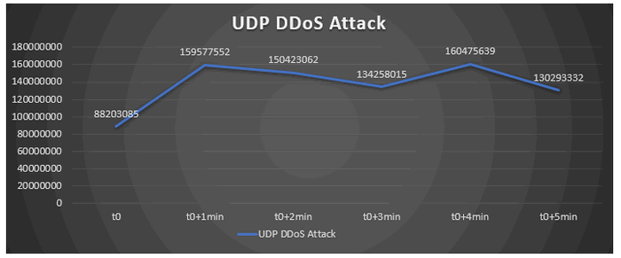
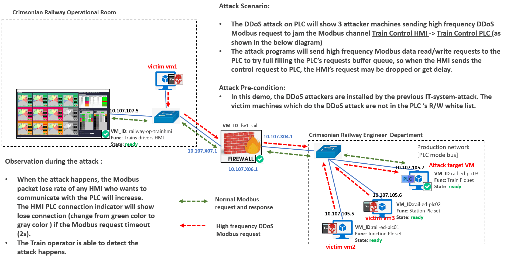
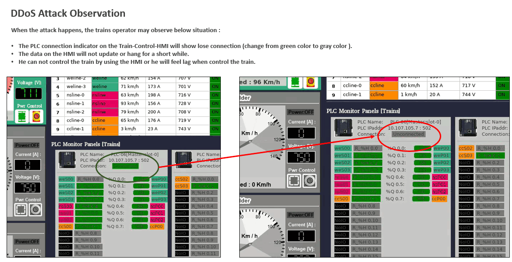

## DDoS Attack Management System

The distributed denial-of-service (DDoS) attack is a malicious attempt to disrupt the normal traffic of a targeted server, service or network by overwhelming the target or its surrounding infrastructure with a flood of Internet traffic. It is a kind of very common and simple attack vector which hackers will use to compromise the victim's network service (such as a website). We want to create a multi-threads service / app layer DDoS attack emulation and management system which can parallel generate hundreds of network requests to one target ( such as SSH, http get/post, UDP, TCP, Modbus ... ) during a time interval. The DDoS attack management can be applied for below purpose : 

1. **Education and Training** : Used for any level of cyber security course about DDoS attack or the related course lab assignment / demo. 
2. **Service stress testing or Penetration testing** :Used for simulate large amount of users to access the target service to do the stress testing or do some penetration test task such as brute force to break web login username / password . 
3. **Attack simulation** : Used for red team to launch DDoS attack in cyber exercise. 
4. **Research** : Used for DDoS attack research such as attack identify, tracing, detection and defense. 

> Important: This project is used for research and education purpose, please don't use the program to attack the real service.

[TOC]

------

### Introduction 

DDoS attacks achieve effectiveness by utilizing multiple compromised computer systems as sources of attack traffic. Exploited machines can include computers and other networked resources such as [IoT devices](https://www.cloudflare.com/learning/ddos/glossary/internet-of-things-iot/). We want to create a distributed DDoS attack launch system which contents one DDoS attack actors repository, several DDoS attackers and one attack control hub. The system structure overview is shown below :



1. The **DDoS Attacker** program is running on single nodes with a attack thread pool to start several hundreds of parallel threads to implement the attack at the same time based on the user's config. Currently we provide 10 different categories service attack actors and user can also easily plug their customized attack program in the attacker.
2. The **DDoS Attack Actors** **Repository** contents several attack actors to send different kinds of network request (such SSH, https-GET, https-POST, SMB login...) to the target. Each attack actor object will be assembled in a attack thread and put in to the attack pool of the related DDoS attacker.
3. The **DDos Control Hub** is used to link all the DDoS attackers together so the user can monitor the current attack state and control each DDoS attacker via the hub's web interface.


------

### System Design

This session will introduce the detailed design of the DDoS Attacker, Attack Actor Repository , DDoS Attack Controller Hub.

#### DDoS Attacker Design

The DDoS attacker is the main program running on each node to implement the DDoS attack, the user can config the attack type, attack threads number and the attack start / stop time. The attacker will have a thread pool, each attack actor need to be assembled in a attack thread then running parallel in the pool. The DDoS attacker system work flow is shown below :



Version `v1.0.2`

Each DDoS Attacker will also report its current attack state to the control hub regularly and fetch the user's control request. The user can start / pause each DDoS attacker's attack process from the hub web user interface. Each Attacker will have its local attack actors repository, during the attacker initialization, the attacker will import the actors from local to build its attack threads pool based on the loaded config file. For each attacker, the max thread number and the request sending speed are different based on the node's hardware spec. 


#### Attack Actors Repository Design 

The attack actors is the minimum functional unit which provides different network service probing function, connection handshake function and request send & receive function. The repo contents different kinds of attack actors to send different kinds of network communication data. Currently we provide 10 different categories of service attack actors. The main network communication functions provided by each attack actors are :

1. **SSH-ATK-Actor** : Provide normal SSH connection, commands execution, jump host / port forwarding with SSH tunneling, SCP file transfer.
2. **HTTP-ATK-Actor** : provide http/https web data fetch, GET / POST requests handling.
3. **NTP-ATK-Actor** : Send time synchronization request ( Network Time Protocol) to time server.
4. **FTP-ATK-Actor** : Send FTP server authorization, folder tree scan, file download and upload.
5. **TCP-ATK-Actor** : Establish TCP handshake , send data to TCP server.
6. **UDP-ATK-Actor** : Send data to UDP server.
7. **SMB-ATK-Actor** : Server Message Block authorization, connect to SMB server to upload / download file.
8. **Modbus-ATK-Actor** : Connect to Modbus device (PLC) to fetch PLC register state or change coils state.
9. **SMTP-ATK-Actor** : SMTP email server login, read email from inbox , send normal / junk email.
10. **POP3-ATK-Actor** : POP3 email server login, read email from inbox , send normal / junk email.


#### DDoS Attack Control Hub

All the DDoS Attacker will report its attack progress to the control hub and fetch the user's attack control request. The control hub will provide a web-UI dashboard to the user ( as shown below ) : 



The information contents : 

- Attacker ID : Each attacker will have one unique ID to register to the control hub. 
- DDoS Type : The attack type ( what kind of attack actor hooked in the attacker ) . 
- Attacker Threads Num : Number of thread running in the attacker's thread pool. 
- DDoS count (/min) : The number of DDoS requests send every min. 
- Start time : The start time (HH:MM:SS) of the DDoS attack. ( `n.a` : if not set,  the DDoS attack will start immediately when the attack start to run )
- Stop time : The end time (HH:MM:SS) of the DDoS attack. (`n.a` : if not set,  the DDoS attack will not stop until attacker receive the pause request from the control hub)
- Target : the attack target. 
- Current State : the current progress. 
- Start Attack button : Press the button will start the DDoS attack immediately. 
- Stop Attack button : Press the button will pause the DDoS attack immediately. 

The use can control multiple DDoS attackers via the web, the communication between attackers and control hub is using the http post. We use the python-flask frame work to build the website.

**ToDo** :

- [ ]  Add the Control to dynamically change the attacker's state. 


------

### Program Setup

This session will introduce the steps to setup DDoS Attacker and Attack Controller  on each host:

#### Setup DDoS Attacker

Development/Execution Environment : python 3.7.4+

Additional Lib/Software Need : 

```
ntplib==0.4.0
paramiko==2.11.0
pythonping==1.1.3
requests==2.28.1
```

Lib folder files : `ConfigLoader.py` , `Log.py`, `networkServiceProber.py`, `SSHconnector.py`, `tcpCom.py` and `udpCom.py`

Program Files List ( To run the `ddosAttacker`, all the files need to be in same folder ) : 

| Program File         | Execution Env | Description                                                  |
| -------------------- | ------------- | ------------------------------------------------------------ |
| ddosAttacker.py      | python 3      | This module is used to create a multi-threads DDoS attack management program which creates a thread pool with different DDoS attack actors, The user can use the exist attack actors or plug in their customized attack actor, then config the detail attack configuration such as start/stop time in the config file. |
| ddosAttackerUtils.py | python 3      | This module is the util functions module to import different kind of DDoS attack actor into the related attack thread then hook into the DDoS attack program |
| ddosAttackCfg.txt    |               | Attacker config file.                                        |
| attackParam.json     | json          | Attack parameter config file.                                |


#### Setup DDoS Attack Control Hub

Development/Execution Environment : python 3.7.4+

Additional Lib/Software Need : 

```
Flask==1.1.2
Flask_SocketIO==5.3.5
```

Lib folder files : `ConfigLoader.py` , `Log.py`

Program Files List ( To run the `ddosAtkHubApp.py`, all the files need to be in same folder ) : 

| Program File         | Execution Env | Description                                                  |
| -------------------- | ------------- | ------------------------------------------------------------ |
| ddosAtkHubApp.py     | python 3      | This module is the main website host program to host DDoS attacker control hub to show the state of each DDoS attacker. |
| ddosAtkHubGlobal.py  | python 3      | The global configuration file                                |
| ddosAtkHubConfig.txt |               | The control hub config file.                                 |


------

### Program Usage

This section will introduce how to usage each program

#### Run DDoS Attacker

Set the config file :  Follow below example to set the config file

```
# This is the config file template for the module <ddosAttacker.py>
# Setup the paramter with below format (every line follows <key>:<val> format, the
# key can not be changed):

# Own unique id used to register in the control hub.
OWN_ID:Test-Attacker[192.168.50.3]

#-----------------------------------------------------------------------------
# define the attack type here:
# TEST - send UDP request to local 127.0.0.1
# SSH - ssh request.
# URL - open url request.
# URL2 - send http/https GET/POST request.
# HTTP - Http / https request.
# UDP - UDP request. 
# TCP - TCP request. 
# MDBUS - Modbus TCP request or OT devices. 

ATK_TYPE:TEST
# ATK_TYPE:SSH
# ATK_TYPE:URL
# ATK_TYPE:URL
# ATK_TYPE:URL2
# ATK_TYPE:FTP
# ATK_TYPE:UDP
# ATK_TYPE:NTP
# ATK_TYPE:TCP

# Attack paramter storage file.(*.json file)
ATK_JSON:attackParam.json

#-----------------------------------------------------------------------------
# Attack start time underformat HHMMSS (if comment the attack will start immediately)
# ATK_ST:105300

# Attack end time under format HHMMSS (if comment the attack will not stop)
# ATK_ET:110000

# Attack parallel threads number 
# ATK_TN:200
ATK_TN:200

#-----------------------------------------------------------------------------
# Flag to identify whether report to the DDoS attack control hub 
RPT_FLG:True

# DDoS attacker control hub ip address and port
HUB_IP:127.0.0.1
HUB_PORT:5000
```


Set the config parameters in the parameter file based on your attack type : 

```
{
    "TEST": {
        "type": "TEST",
        "targetSum" : "localhost:3000"
    },

    "SSH": {
        "cmdlines": [
            "ls",
            "pwd",
            "ip a",
            "who",
            "ps"
        ],
        "ipaddress": "****",
        "username": "****",
        "password": "****",
        "cmdinterval": 0.01,
        "targetSum" : "****"
    },

    "URL": {
        "type": "url",
        "urlList": [
            "https://****/"
        ],
        "targetSum" : "https://****/"
    },

    "URL2": {
        "type": "req",
        "urlList": [
            {
                "url": "https://****.typicode.com/posts/",
                "type": "get",
                "parm": {
                    "id": [ 1, 2, 3 ],
                    "userId": 1
                }
            },
            {
                "url": "https://****.typicode.com/posts",
                "type": "post",
                "parm": {
                    "userID": 1,
                    "id": 1,
                    "title": "Making a POST request",
                    "body": "This is the data we created."
                }
            }
        ],
        "targetSum" : "https://****"
    },

    "NTP": { 
        "urlList": [ "0.****.ntp.org"],
        "targetSum" : "****.ntp.org"
    },

    "FTP":{
        "urlList":["ftp.****.org"],
        "targetSum" : "ftp.****.org"
    },

    "UDP":{
        "ipaddress": "127.0.0.1",
        "port": 3003,
        "respFlg": true,
        "msg" : [
            "udp-test-message 1",
            "udp-test-message 2",
            "udp-test-message 3",
            "udp-test-message 4"
        ],
        "targetSum" : "localhost:3003"
    },

    "TCP":{
        "ipaddress": "127.0.0.1",
        "port": 3004,
        "respFlg": true,
        "msg" : [
            "tcp-test-message 1",
            "tcp-test-message 2",
            "tcp-test-message 3",
            "tcp-test-message 4"
        ],
        "targetSum" : "localhost:3004"
    }
}
```

>  `targetSum` is the target info shown in the control hub.

Run the Attacker: 

```
python3 ddosAttacker.py
```


#### Run DDoS Attack Control Hub

1. Set the config file ( disable the test mode flag )

2. Run the control hub program

   ```
   python3 ddosAtkHubApp.py
   ```

3. Login the web url via http://127.0.0.1:5000


------

### System Use Case

##### Test case 1 : UDP DDoS attack on UDP server

Apply the UDP DDoS attack from a single node to a UDP server : 

- Target : UDP server in local subnet
- Threads number : 400
- Attack Machine : OS [ Window-10 ] , CPU: i7-10750H 12C, 16G RAM, 10G NIC
- DDoS Attack Count (/min):




##### Test case 2 :  DDoS HTTPs attack send Post request 

Apply the UDP DDoS attack from a single node to a web server : 

- Target : A public edu website.
- Threads number : 200
- Attack Machine : OS[Window-10], CPU: i7-10750H 12C, 16G RAM, 10G NIC
- DDoS Attack Count (/min):


##### Use case 3  : DDoS Modbus TCP Attack on PLC in OT-Network 

Project link: [ddodPlcAttacker](../ddosPlcAttacker/readme.md)

Apply the Modbus DDoS attack from 3 attack nodes  : 

- Target : PLC in the production network.
- Threads number : 200 
- Attack Machine : OS[Window-10], CPU: 8C, 16G RAM, 1G NIC
- Attack scenario : 





Demo video : https://youtu.be/ZG5Y1A3nbKY?si=hKuJ765Q9KL-CdQO


------

#### Problem and Solution

Refer to `doc/ProblemAndSolution.md`


------

> Last edit by LiuYuancheng(liu_yuan_cheng@hotmail.com) at 26/11/2023, if you have any problem, please send me a message. 