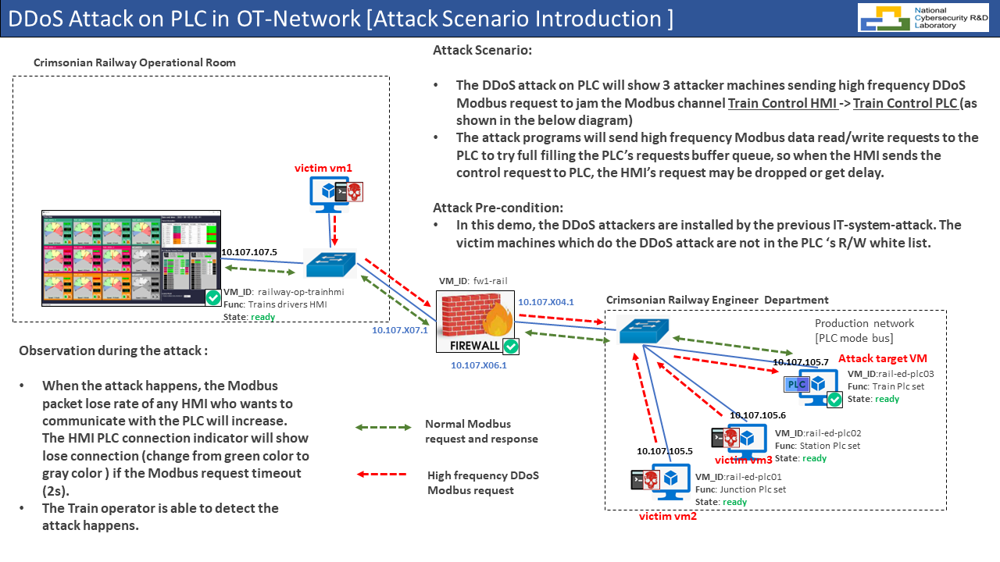
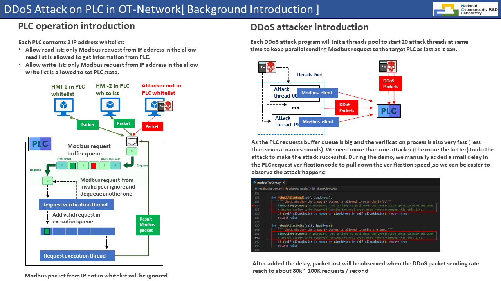
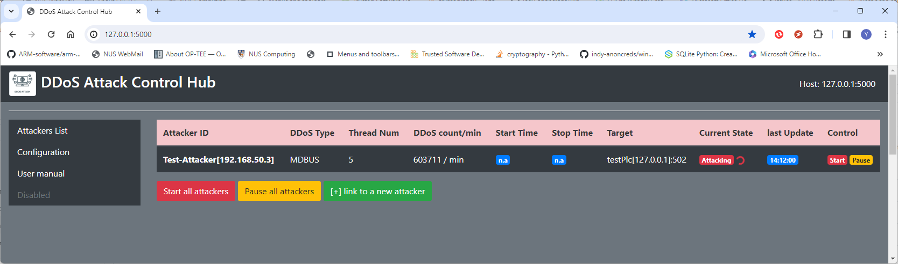

# DDoS PLC(Modbus-TCP) Attacker

**Program design purpose :** we want to create a red team distributed denial-of-service (DDoS) attacker program which can be integrated in our [DDoS Control System](https://github.com/LiuYuancheng/Python_Malwares_Repo/tree/main/src/ddosAttacker) to simulate launching Modbus-TCP DDoS attack to jam / denial a PLC or the Modbus-TCP protocol based OT-device. This program was used for the [Cross Sword 2023 Cyber Exercise](https://www.linkedin.com/posts/natoccdcoe_crossedswords-activity-7140986334961217536-7dM5/?utm_source=share&utm_medium=member_desktop) test run Railway OT system attack demo.

[TOC]

**Table of Contents**

- [DDoS PLC(Modbus-TCP) Attacker](#ddos-plc-modbus-tcp--attacker)
    + [Introduction](#introduction)
        * [OT-Attack Scenario Introduction](#ot-attack-scenario-introduction)
        * [DDoS Attack Effect](#ddos-attack-effect)
    + [Attack Background Knowledge](#attack-background-knowledge)
        * [PLC peer request handling and filtering function](#plc-peer-request-handling-and-filtering-function)
        * [Modbus-TCP request handling  mechanisms](#modbus-tcp-request-handling--mechanisms)
        * [DDoS attack detail Introduction](#ddos-attack-detail-introduction)
        * [DDoS attack observation](#ddos-attack-observation)
    + [Program Setup](#program-setup)
        * [Program Files List](#program-files-list)
    + [Program Usage](#program-usage)
      - [Problem and Solution](#problem-and-solution)

------

### Introduction 

This PLC DDoS attack program is modified from the standard DDoS attack program `<DDoSattacker.py>` [source_code](https://github.com/LiuYuancheng/Python_Malwares_Repo/blob/main/src/ddosAttacker/ddosAttacker.py)  by adding the PLC Modbus-TCP communication module. As it inherited the standard DDoS attacker program, the red team attackers can use our [DDoS C2 Hub](https://github.com/LiuYuancheng/Python_Malwares_Repo/tree/main/src/ddosAttacker)  remote control the DDoS attack procedure to interrupt the XS2023 railway OT system's Modbus communication between  `Train Control PLCs (PCL07/08)` and  the `Train Control HMI`.

##### OT-Attack Scenario Introduction 

- The DDoS attack on PLC will show 3 red team attack machines (with the Modbus DDoS attackers) sending high frequency DDoS Modbus-TCP request to jam the Modbus channel `Train Control HMI` => `Train Control PLC` (as shown in the below diagram).
- The attack programs will try to full filling the PLC’s requests buffer queue via large amount of Modbus-TCP request, so when the  operation room HQ `Train Control HMI` sends the control request to PLC, the HMI’s request may be ignored by the PLC because of the queue full. 

##### DDoS Attack Effect  

The effected VMs in the OT network is shown below : 



- When the attack happens, the HMI-PLC channel Modbus-TCP packets lose rate will keep increasing. The HMI PLC connection indicator will show lose connection (change from green color to gray color ) if the Modbus request timeout (2 sec).
- The HQ train operator is able to detect the attack happens as data shown on the HMI is interrupted or got delay. 


------

### Attack Background Knowledge

##### PLC peer request handling and filtering function

Each PLC contents 2 IP addresses whitelist to handling the Modbus data I/O from different peer :

- Allow read list: only Modbus request from IP address in the `allow read list` is allowed to get information from PLC. 
- Allow write list: only Modbus request from IP address in the `allow write list` is allowed to set PLC state.

The PLC will ignore the Modbus-TCP request source which not in the 2 white lists.

##### Modbus-TCP request handling  mechanisms

When a Modbus-TCP request is sent from HMI or other control device and reach to the PLC, the PLC firmware program will follow below sequence to process the request : 

1. The Modus-TCP request will be save in the OS socket buffer. 
2. PLC program (firmware) will fetch the Modbus-TCP data and enqueue the request (so the PLC can handle the  request from different peers in sequential)
3. When the PLC dequeue the request, the filter function will drop the not valid request (read request but request peer is not in allow read list or write request but peer is not in allow write list)
4. PLC will execute the ladder diagram based on the Modbus request and PLC electrical I/O signal, the generate the related response for the request and send the response to the related peer(source). 

The detail Modbus-TCP data flow is shown below:



##### DDoS attack detail Introduction 

Each DDoS attack program will initialize a threads pool to start 20 Modbus attack threads at same time to keep parallel sending Modbus request to the target PLC as fast as possible. All the attackers are also controlled by the attack control hub (so we can make all the attacker start at nearly same time), The DDoS attacker system work flow is shown below :


Each DDoS Attacker will also report its current attack state to the control hub regularly and fetch the user's control request. The user can start / pause each DDoS attacker's attack process from the hub web user interface. Each Attacker will have its local attack actors repository, during the attacker initialization, the attacker will import the actors from local to build its attack threads pool based on the loaded config file. For each attacker, the max thread number and the request sending speed are different based on the node's hardware spec. 

##### DDoS attack observation

When the attack happens, the trains operator may observe below situation :

- The PLC connection indicator on the Train-Control-HMI will show lose connection (change from green color to gray color ). 
- The data on the HMI will not update or hang for a short while. 
- He can not control the train by using the HMI or he will feel lag when control the train.


------

### Program Setup

To setup the DDoS Control Hub please follow this readme file:

https://github.com/LiuYuancheng/Python_Malwares_Repo/blob/main/src/ddosAttacker/readme.md

Development/Execution Environment : python 3.7.4+

Additional Lib/Software Need : 

```
pyModbusTCP==0.2.1
requests==2.28.1
```

##### Program Files List

| Program File         | Execution Env | Description                                                  |
| -------------------- | ------------- | ------------------------------------------------------------ |
| ddosAttacker.py      | python 3      | This module is used to create a multi-threads DDoS attack management program which creates a thread pool with different DDoS attack actors, The user can use the exist attack actors or plug in their customized attack actor, then config the detail attack configuration such as start/stop time in the config file. |
| ddosAttackerUtils.py | python 3      | This module is the util functions module to import different kind of DDoS attack actor into the related attack thread then hook into the DDoS attack program |
| ddosAttackCfg.txt    |               | Attacker config file.                                        |
| modBusAtkParam.json  | json          | Attack target PLC's detail information.                      |
| modbusTcpCom.py      | python        | Modbus-TCP communication module                              |
| plcServerTest.py     | python        | Test program to simulate the target PLC program.             |


------

### Program Usage

This section will introduce how to usage each program

Set the config file of the DDoS attacker (rename the `ddosAttackCfg_template.txt` to `ddosAttackCfg` ):

```
# This is the config file template for the module <ddosAttacker.py>
# Setup the paramter with below format (every line follows <key>:<val> format, the
# key can not be changed):

# Own unique id used to register in the control hub.
OWN_ID:DDoS-Attacker[192.168.50.3]

#-----------------------------------------------------------------------------
# define the attack type here:
# TEST - send UDP request to local 127.0.0.1
# SSH - ssh request.
# URL - open url request.
# URL2 - send http/https GET/POST request.
# HTTP - Http / https request.
# UDP - UDP request. 
# TCP - TCP request. 
# MDBUS - Modbus TCP request or OT devices. 

ATK_TYPE:MDBUS

# Attack paramter storage file.(*.json file)
ATK_JSON:modBusAtkParam.json

#-----------------------------------------------------------------------------
# Attack start time underformat HHMMSS (if comment the attack will start immediately)
# ATK_ST:105300

# Attack end time under format HHMMSS (if comment the attack will not stop)
# ATK_ET:110000

# Attack parallel threads number 
# ATK_TN:200
ATK_TN:5

#-----------------------------------------------------------------------------
# Flag to identify whether report to the DDoS attack control hub 
RPT_FLG:True

# DDoS attacker control hub ip address and port
HUB_IP:127.0.0.1
HUB_PORT:5000
```

Set the target PLC data in the `modBusAtkParam.json` as shown below;

```
{
    "MDBUS": {
        "type": "MDBUS",
        "ipaddress": "10.107.105.6",
        "port": 502,
        "targetSum" : "testPlc[10.107.105.6]:502"
    }
}
```

Run the Modbus-TCP DDoS attacker:

```
python3 ddosPlcAttacker.py
```

Check whether DDoS attacker has registered on C2:



Press the "`start`" button in the control column, then the DDoS attack will start.


------

#### Problem and Solution

Refer to `doc/ProblemAndSolution.md`


------

> Last edit by LiuYuancheng(liu_yuan_cheng@hotmail.com) at 14/01/2024, if you have any problem, please send me a message.  Copyright (c) 2023 LiuYuancheng