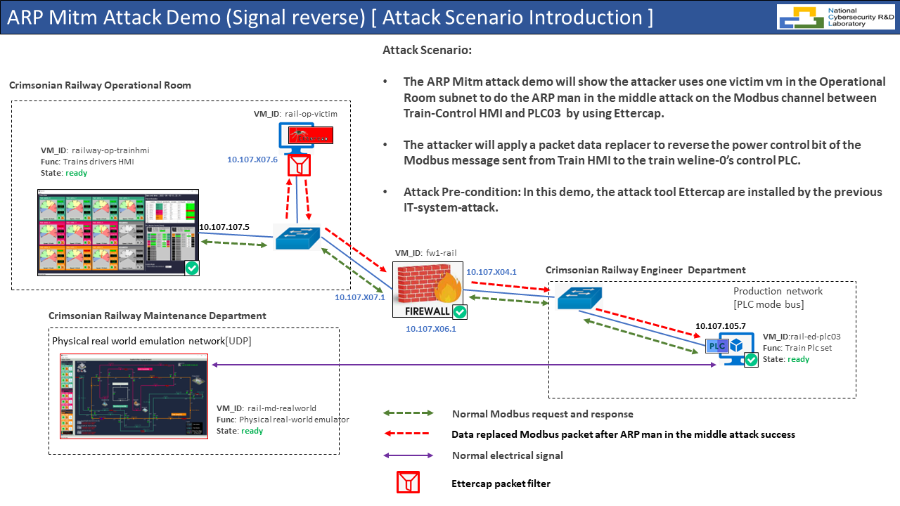
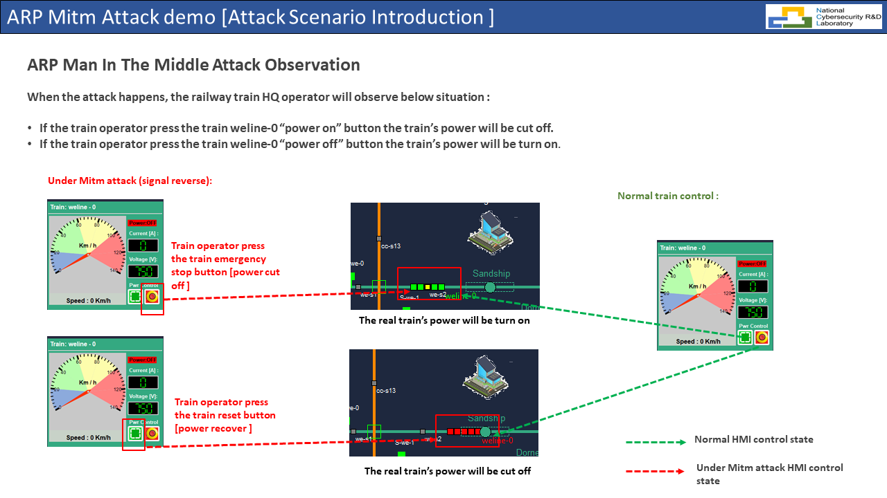
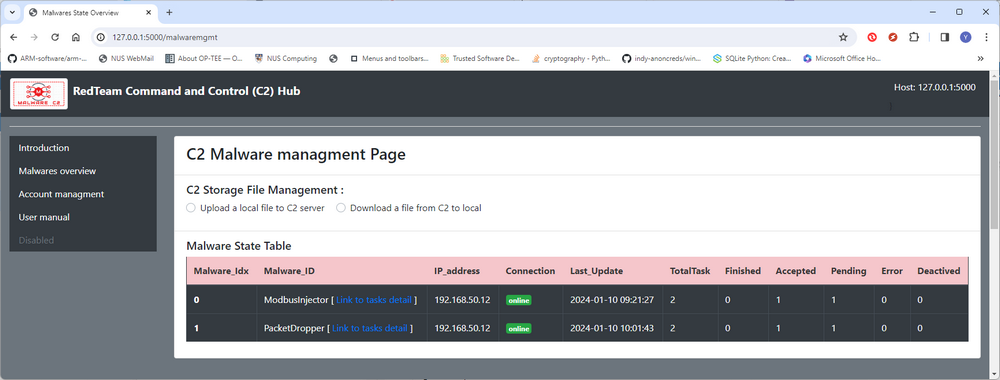
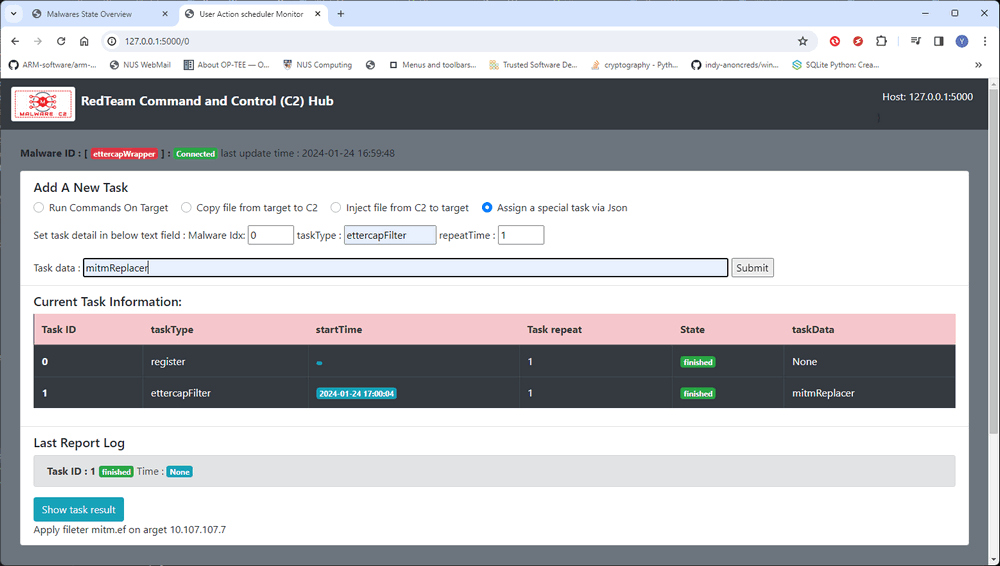

# Man in the Middle Attacker 

**Program design purpose** : We want to create a Man in the Middle Attacker which can be integrated in our C2 Emulation system to use the comprehensive suite software [Ettercap](https://www.ettercap-project.org/) to implement the Man in the Middle attack to reverse the byte data in the OT system HMI-PLC Modbus control channel. This program will be used for the [Cross Sword 2023 Cyber Exercise](https://www.linkedin.com/posts/natoccdcoe_crossedswords-activity-7140986334961217536-7dM5/?utm_source=share&utm_medium=member_desktop) test run Railway OT system attack demo.

**Attack Vector** : ARP Spoofing, Man-in-the-middle attack, packet data replacement

[TOC]

**Table of Contents**

- [Man in the Middle Attacker](#man-in-the-middle-attacker)
    + [Introduction](#introduction)
        * [OT-Attack Scenario Introduction](#ot-attack-scenario-introduction)
        * [Man-in-the-Middle Attack Observation](#man-in-the-middle-attack-observation)
    + [Program Setup](#program-setup)
        
        * [Program File List](#program-file-list)
    + [Program Usage](#program-usage)
        * [Start Man-in-the-Middle Attack data replacer from C2](#start-man-in-the-middle-attack-data-replacer-from-c2)
        * [Mitm attack  (packet data modify) demo video](#mitm-attack---packet-data-modify--demo-video)
      
      - [Problem and Solution](#problem-and-solution)

------

### Introduction 

The Man-in-the-Middle attack scenario is a more complex APR attack case which based on a successful ARP spoofing attack. For the ARP spoofing attack please refer to the [ARP Spoofing Attacker [Packet Drop] doc](readme.md)

A Man-in-the-Middle (MitM) attack involves an unauthorized third party intercepting and potentially altering communications between two parties without their knowledge. In the context of replacing data, an attacker might intercept and modify the information being exchanged between two entities. MitM attacks can be executed in various ways, including DNS spoofing, ARP spoofing, session hijacking, or by exploiting vulnerabilities in the communication protocols.  There will be five main attack vectors of MitM attack on Operational Technology (OT) systems: 

- **Interception:** The attacker positions themselves between the communication channels of two parties. This could happen on a network, at a Wi-Fi hotspot, or even through compromised network devices.
- **Packet Sniffing:** The attacker captures the data packets passing between the two parties. This could include login credentials, sensitive information, or any other data being transmitted.
- **Data Modification:** The attacker can modify the intercepted data packets to suit their malicious objectives. For example, they could change the content of an email, alter the details of a financial transaction, or manipulate any other information being transmitted.
- **Delivery:** The modified data is then delivered to its intended recipient, who is unaware that the information has been tampered with.
- **Avoiding Detection:** To avoid detection, the attacker might also modify the data in a way that seems plausible and consistent with the overall communication. For example, they might alter the amount in a financial transaction to a reasonable sum to avoid immediate suspicion.

##### OT-Attack Scenario Introduction  

The Mitm attack demo will show the attacker uses one victim node in the Operational Room subnet to do the ARP man in the middle attack on the Modbus channel between Train-Control HMI and PLC03 by using Ettercap. 

The attacker will sniffing the HMI-PLC control chain data package, analyze the packet data structure and apply a packet data replacer to reverse/modify the power control bit of the Modbus message sent from Train HMI to the train weline-0’s control PLC.

> Attack Pre-condition : In this demo, the attack program ettercapWrapper.py and Ettercap will be pre-installed by the previous IT-system-attack in one of the maintenance engineer's laptop which in the Train operation room subnet same as the HQ-Human Machine Interface (HMI) machine. 

The attack path in the cyber range is shown below : 



##### Man-in-the-Middle Attack Observation

When the attack happens, the railway train HQ operator will observe below situation :

- If the train operator press the train weline-0 “power on” button the train’s power will be cut off.
- If the train operator press the train weline-0 “power off” button the train’s power will be turn on

The effect detail is shown below:



------

### Program Setup

To setup the false data injection program please refer to victim vm's ansible readme file: 

https://github.com/LiuYuancheng/Cross-Sword-2023-Nato-Event/blob/main/ansibleVM/railway-op-victim/Readme.md

Development/Execution Environment : python 3.7.4+

Additional Lib/Software Need : 

- Ettercap Installation : https://installati.one/install-ettercap-common-ubuntu-20-04/

##### Program File List

| Program File                    | Execution Env | Description                                    |
| ------------------------------- | ------------- | ---------------------------------------------- |
| ettercapWrapper.py              | python 3      | Main ARP spoof attacker packet droping program |
| ConfigLoader.py                 | python 3      | lib file : Configuration file loader           |
| c2Client.py                     | python 3      | lib file : C2 server communication file        |
| c2MwUtils.py                    | python 3      | lib file : malware data storage module         |
| ettercapWrapperCfg_template.txt |               | program config file                            |
| filter.json                     | json          | The Ettercap filter's config file.             |
| filters/mitm.ef                 | C++           | The Compiled Ettercap packet data replacer     |


------

### Program Usage

To use the program, the host server need to pre-install the Ettercap tool : [Installation Link](https://installati.one/install-ettercap-common-ubuntu-20-04/) 

Set the config file base on your C2 server and attack target setting (rename the `ettercapWrapperCfg_template.txt` to `ettercapWrapperCfg.txt`) : 

```
# This is the config file template for the module <ettercapWrapper.py>
# Setup the paramter with below format (every line follows <key>:<val> format, the
# key can not be changed):

#-----------------------------------------------------------------------------
# Define the malware own info
OWN_ID:ettercapWrapper
# Change this line to 10.107.{{ team_nr }}07.5 during the event.
OWN_IP:192.168.50.10

#-----------------------------------------------------------------------------
# Init the C2 IP address
# Change this line to 10.106.{{ team_nr }}07.11 during the event.
C2_IP:127.0.0.1
C2_PORT:5000
# The interval to report to C2
C2_RPT_INV:5
# Init the C2 connection protocal
C2_HTTPS:False

#-----------------------------------------------------------------------------
# Init the filter folder and files.
FILTER_DIR:filters
FILTER_RCD:filter.json
```

Run the Ettercap Wrapper under **sudo**  (to apply the filter, Ettercap need to be run under admin permission), then the Ettercap Wrapper will link to C2 server:

```
sudo python3 ettercapWrapper.py
```

Check whether the Ettercap Wrapper registered on C2:



##### Start Man-in-the-Middle Attack data replacer from C2

Select the ettercapWrapper control page, then select the **Assign a special task via Json**, then fill in the task detail : 

- TaskType: `ettercapFilter`
- Repeat: `1`
- Tasks data: `mitmReplacer <filter name>`



Press the `submit` button, when the Ettercap wrapper report the task running,the Ettercap will applied the filter to keep block the traffic which incoming or outgoing the target. For the target information, please refer to the filter.json file, below is one dropper filter example, you can create your own filter and put in the filters folder and give a filter unique name in the filter.json file so you can apply it on the traffic:

```
"mitmReplacer" : {
	"ipaddress": "10.107.107.7",
	"protocalType": "TCP",
	"port":502,
	"description": "Replace the specific bytes data in the HMI-PLC ModBus-Tcp communication channel to reverse the HMI control cmd",
	"filterFile": "mitm.ef"
}
```


##### Mitm attack  (packet data modify) demo video

To check the demo video, please refer to this link in my you tube channel: https://www.youtube.com/watch?v=fUC-DeNE_oM


------

#### Problem and Solution

Refer to `doc/ProblemAndSolution.md`


------

> Last edit by LiuYuancheng(liu_yuan_cheng@hotmail.com) at 24/01/2024, if you have any problem, please send me a message.  Copyright (c) 2023 LiuYuancheng