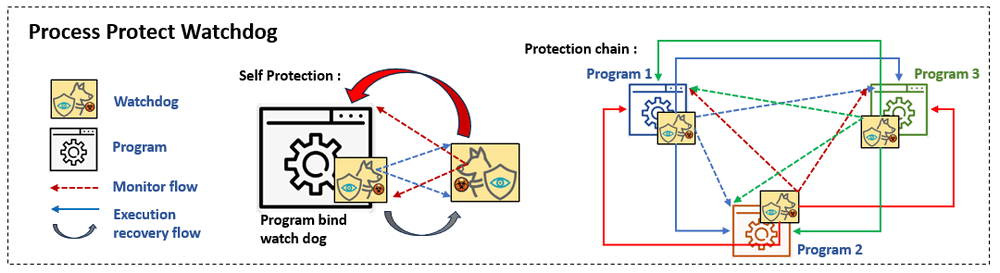
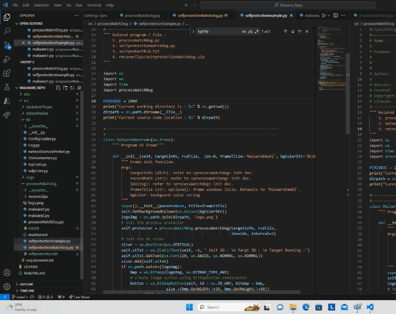
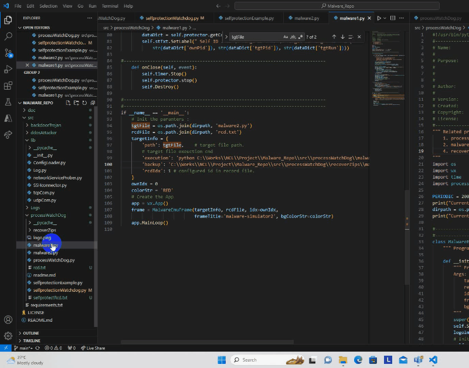
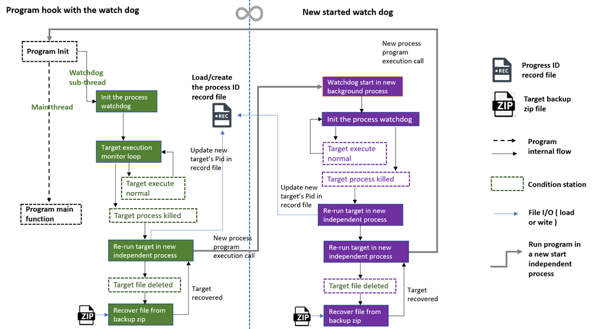
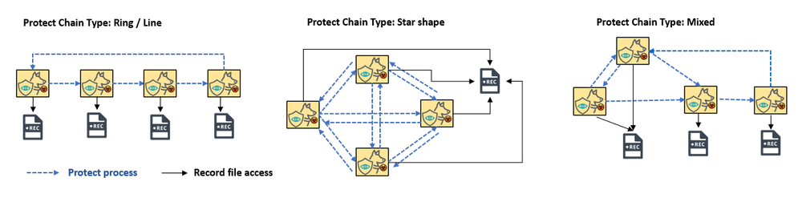

# Python Process Watchdog 


**Project Design Purpose** : During participating the cyber exercise as red team member, we found that the injected malware or attack launching program can easy be stopped by the blue team or defense program / mechanisms via killing the process / deleting the file. To address this, our project aims to develop a robust watchdog program designed to bind to target programs, diligently monitor their execution states, and ensure uninterrupted functionality.

- **Continuous Monitoring : **Establish a vigilant watchdog program that binds seamlessly to the target program, enabling real-time monitoring of its execution state.
- **Dynamic Response Mechanism : **Implement a responsive system that, in the event of the target program being closed or its process terminated, automatically initiates a new, independent process to resume program execution.
- **File Integrity and Recovery : **Create a safeguard mechanism capable of detecting instances where the target program file is deleted. Upon identification, the watchdog will promptly restore the program from a designated backup, ensuring minimal downtime.

The watchdog not only shields the program during execution, but also can be used  in the **Cyber Exercise Red Teaming**, **Service Program Protection** and **Malware Action Detection Research**. The user can bind the watchdog to a single program to make it protect itself or hook several programs with watchdog to build a protection chain to make them auto protect each other.

```python
# Created:     01/12/2023
# Version:     v_0.1.2
# Copyright:   Copyright (c) 2024 LiuYuancheng
# License:     MIT License
```

**Table of Contents**

[TOC]

- [Python Process Watchdog](#python-process-watchdog)
    + [Introduction](#introduction)
        * [Background Knowledge about Watchdog](#background-knowledge-about-watchdog)
        * [Individual Program Self Protection Demo](#individual-program-self-protection-demo)
        * [Protection Chain Demo](#protection-chain-demo)
    + [Program Design](#program-design)
        * [1. Related Files](#1-related-files)
        * [2. Watchdog Internal Information](#2-watchdog-internal-information)
        * [3. Protection Chain Build](#3-protection-chain-build)
    + [Protect Chain Work Progress Example](#protect-chain-work-progress-example)
        * [Initialization State](#initialization-state)
        * [Add new watchdog into the protection chain](#add-new-watchdog-into-the-protection-chain)
        * [Protection chain recovery](#protection-chain-recovery)
    + [Program Setup and Usage](#program-setup-and-usage)
      - [Program Setup](#program-setup)
      - [Program Usage](#program-usage)
        * [Used for self protection](#used-for-self-protection)
        * [Used watchdog to build protection chain](#used-watchdog-to-build-protection-chain)
      - [Problem and Solution](#problem-and-solution)

------

### Introduction 

We aim to deliver a Python program execution protection watchdog library, designed for effortless integration into existing programs, serving as a defense against unauthorized termination by external entities or software. This library is crafted to empower users with a user-friendly and robust tool, offering both prevention and recovery measures to enhance the resilience of their programs against unintended disruptions or deliberate interference. The overview work flow of the watchdog lib is shown below : 



Version : `v1.0.1`

The watch dog will also provide target execution file recovery function : if in the event that the protected program is deleted, the watchdog will step in, facilitating the restoration of the target program and ensuring its seamless re-execution.


##### Background Knowledge about Watchdog

> A watchdog in the context of computer programs typically refers to a mechanism or a piece of software designed to monitor the execution of another program or system and take action if it detects certain issues or anomalies. The purpose of a watchdog is to ensure the continued and reliable operation of the monitored system.
>
> Here's how a typical watchdog mechanism works:
>
> 1. **Monitoring :**The watchdog monitors the behavior or status of a specific program or system.
> 2. **Timeouts :** The watchdog sets predefined timeouts. If the monitored program/system doesn't report back or complete a specific task within the expected timeframe, the watchdog assumes that something might be wrong.
> 3. **Action : **When a timeout or an issue is detected, the watchdog takes predefined actions. These actions can include restarting the monitored program, triggering an alarm, logging the issue for analysis, or even shutting down the entire system to prevent further damage.
> 4. **Health Checking :** In addition to timeouts, watchdogs may perform health checks on the monitored system. If the system's health falls below a certain threshold, the watchdog can trigger corrective actions.


##### Individual Program Self Protection Demo 

Users have the flexibility to bind the watchdog to a single program, enabling it to autonomously protect itself against potential threats or disruptions. The following demonstration illustrates how a program, integrated with the watchdog, can self-protect, preventing external attempts to terminate or stop it. Even the user both terminates the program and deletes its files, the watchdog initiates a self-recovery process, ensuring the continuous and uninterrupted execution of the program.



Version : `v1.0.1`

Entire Full HD video on YouTube :  [View the full demo on YouTube](https://www.youtube.com/watch?v=coAn714g6Ok)


##### Protection Chain Demo

Protection Chain Configuration offer Offers the capability to establish protection chains by hooking the watchdog to multiple programs. This collaborative approach ensures that the programs within the chain proactively protect each other. The following demonstration highlights the process of programs binding with the watchdog to construct a protective chain, fostering mutual defense among them. Regardless of the number of programs in the chain that a user attempts to terminate, if there is more than one program actively running, all the programs in the chain will be recover in the end. 



Version : `v1.0.1`

Entire Full HD video on YouTube :  [View the full demo on YouTube](https://youtu.be/L-utChNhLBs?si=bAm2zyx19QtRsf_m)

>  The protection watchdogs can also use in embedded systems, critical infrastructure, servers, and other environments where continuous operation is crucial to help prevent issues like software freezes, crashes, or other unexpected failures from causing prolonged downtime. 


------

### Program Design

The program protection watchdog will run in sub-thread parallel with the main hooked program thread. It will monitor the protect target's process, if the target process is stopped, it will start a new individual process to run the target. In a self-protective scenario, the watchdog spawns a twin "shadow" watchdog in the background as a separate individual process. This dual-layered defense strategy involves the primary program's watchdog safeguarding the shadow watchdog, while the shadow watchdog reciprocally protects the main program. This intricate protection deadlock mechanism ensures a robust shield against potential disruptions, creating a resilient and interlocked defense system. The program work flow diagram is shown below : 



Version : `v1.0.1`

##### 1. Related Files 

Except the program, there are two related files the watchdog will also keep : 

**1.1 Watchdog Process ID record file** 

The record file is used by watchdog to save, recover and share the protection information, assume watchdog is protecting a program-A, if we kill watchdog and restart it, it will load there record file and continuous monitor the current running program-A instead re-execute program-A in a new process. The main feature / function of the process ID record file are : 

- A text format ( `*.txt`) history record file .
- If the user want to build a protect chain, they don't need to keep several record files, link all the watchdogs to one record file then the watchdog can share it own info in the record file and fetch others information from the record file, and finally they will auto-build the chain to protect each other.
- If the watchdog detect the record file is missing, it will start to create a new record file and save all its current stored protected targets information in the file. 

**1.2 Target Program Recover Zip File **

The target program recover zip file is used as the program backup installation file, it will be used when the user / anti-malware program deleted the protection target : 

- A zip file contents all the target program's execution related file .

- If the user want the target program can be recovered when the program is delete, compress the target program's all files in a zip file and set the watchdog's backup file path, the watchdog will unzip the file and recover the target if some file is missing. 

  

##### 2. Watchdog Internal Information 

Each watchdog maintains comprehensive information about its protected targets, dynamically expanding as the protection chain grows. This information encompasses the following details:

- **2.1 Target Programs' Path :** A list of the path of the protected programs or software. In each clock cycle, the watchdog diligently checks for the program's existence. If the file is not found ( perhaps deleted by an external entity ) , the watchdog initiates a recovery process, restoring all related files from its designated backup storage zip file.

- **2.2 Target Execution Detail : ** Encompasses the specific steps, commands, and parameters required to execute the target program. In the event of the target program being halted, the watchdog, armed with these execution details, seamlessly re-initiates and executes the target program.

- **2.3 Self Index and Process ID :** Records the watchdog's own process ID, stored in the process record file based on an index. This information is utilized by other watchdogs within the protection chain to  defend the watchdog itself.

- **2.4 Target Index and Process ID :** Captures the process ID and index of the protected target in the record file. If the process with the specified ID is non-existent, the watchdog takes corrective action by re-executing the target program and updating the record file with the new process ID in the designated index position.

- **2.5 Record File Path:** Specifies the path of the record file, a crucial repository of historical information facilitating the watchdog's operations. Each watchdog can only set one record file path 

- **2.6 Recover File Path:** Identifies the path of the zipped target program file crucial for recovery processes. This ensures that, in the event of any disruption, the watchdog can swiftly retrieve and restore the target program from its backup, maintaining the integrity of the protection chain.

  

##### 3. Protection Chain Build

To build a protect chain, the user can use peer to peer protection config ( each peer share one record file )  to build the protection ring or make several watchdogs to share one record file to build a hub sharp protection chain or create a mixed one as shown below : 



Version : `v1.0.1`

The Chain building logic is this : The watch dog will try to protect the program which share the same record file with it ( if it has the target execution detail in its record ) . The beauty of this design is its flexibility and automation : 

For instance, seamlessly integrating a new watchdog into an existing protection chain is a streamlined process. To achieve this, deploy the execution details of the new watchdog into the target execution detail list of **any ONE** watchdog within the chain. Subsequently, direct the new watchdog's record file to the shared record file of the chain. With this simple configuration, the new watchdog becomes seamlessly integrated and protected by the chain. And the new watchdog will load other watchdog information in the chain from the record file and auto start to protect the others.


------

### Protect Chain Work Progress Example

##### Initialization State

In this example we will show how to add new watchdog in an exist protect chain and how the protect chain can be recovered from a single running watchdog. There are 3 watchdogs program in the scenario, the init state is : 

- **malware0** : Program inside the protection chain, with `watchdog0`  Init state protect `malware1` in the protection chain. 
- **malware1** : Program inside the protection chain, with `watchdog1`  Init state protect `malware0` in the protection chain. 
- **malware2** : Program outside the protection chain, with `watchdog2` init state set protection target to `None`.

Below example is the record file `malware0` and `malware1`, `malware0`'s record-Idx is 0 and `malware1`'s  record-Idx is 1 , there execution details are also record inside the record file :

```
# An example of the protection record
{
    'path': C:\\xxx\\malware0.py.
    'execution': 'python C:\\xxx\\malware0.py',  
    'backup': 'C:\\xxxx\\malware0.zip', 
    'processID': 14332,
    'rcdIdx': 0 # configured id in record file.
}
{
    'path': C:\\xxx\\malware1.py.
    'execution': 'python C:\\xxx\\malware1.py',  
    'backup': 'C:\\xxxx\\malware1.zip', 
    'processID': 36602,
    'rcdIdx': 1 # configured id in record file.
}
```

Programs' watchdog state : 

| Program name (with watchdog) | Self state | Init protect target | Current protecting target |
| ---------------------------- | ---------- | ------------------- | ------------------------- |
| malware0                     | running    | malware1            | malware1                  |
| malware1                     | running    | malware0            | malware0                  |


##### Add new watchdog into the protection chain

**Step 1** : Now if we want to add new program `malware2` into the protection chain, we just need to point the `malware2` ( with `watchdog2` )'s record path to the same record file as `malware0` & `malware1`, then give the `malware2`'s `watchdog2` a new record-Idx = 2 . After run the `malware2`, the programs' watchdog state will shown as below (malware2 load the record file, file 2 protection targets, then add then into its protection target list) : 

| Program name (with watchdog) | self state | Init protect target | Current protecting target |
| ---------------------------- | ---------- | ------------------- | ------------------------- |
| malware0                     | running    | malware1            | malware1                  |
| malware1                     | running    | malware0            | malware0                  |
| malware2                     | running    | None                | malware0, malware1        |

**Step 2** : As the `malware2` didn't find its own record-Idx  == 2  in the record file, it will  append its own execution details in the record file. And the new record file will be changed to below : 

```
{
    'path': C:\\xxx\\malware0.py.
    'execution': 'python C:\\xxx\\malware0.py',  
    'backup': 'C:\\xxxx\\malware0.zip', 
    'processID': 14332,
    'rcdIdx': 0 
}
{
    'path': C:\\xxx\\malware1.py.
    'execution': 'python C:\\xxx\\malware1.py',  
    'backup': 'C:\\xxxx\\malware1.zip',
    'processID': 36602,
    'rcdIdx': 1
}
{
    'path': C:\\xxx\\malware2.py.
    'execution': 'python C:\\xxx\\malware2.py',  
    'backup': 'C:\\xxxx\\malware2.zip', 
    'processID': 5002,
    'rcdIdx': 2
}
```

After the `malware2` append its own information in the record file, in the next check loop of the `malware0` and `malware1`, they found a new target need them to protect. Then the current programs' state will change to below 

| Program name (with watchdog) | self state | Init protect target | Current protecting target |
| ---------------------------- | ---------- | ------------------- | ------------------------- |
| malware0                     | running    | malware1            | malware1, malware2        |
| malware1                     | running    | malware0            | malware0, malware2        |
| malware2                     | malware2   | None                | malware0, malware1        |

The new watchdog `malware2` is added in the protection chain.


##### Protection chain recovery

As shown in the previous section, when the `malware0` or `malware1` do the checking, they will also load the `malware2`'s new execution detail into their memory. Now if we stop `malware2`,  the `malware0` or `malware1` will auto re-execute (recover) `malware2`. 

Assume now if we kill `malware2` and `malware0` , and delete the record file at the same time.

The current programs state will shown blow : 

| Program name (with watchdog) | self state | Init protect target | Current protecting target |
| ---------------------------- | ---------- | ------------------- | ------------------------- |
| malware0                     | killed     | malware1            | None                      |
| malware1                     | running    | malware0            | malware1, malware2        |
| malware2                     | killed     | None                | None                      |

Currently we only left `malware1` running, in its execution clock, it will rebuild the record file based on its current state first. Then it will re-execute the killed 2 malwares. Before `malware0` and `malware2` run the watchdog clock, the rebuild record file will be below: 

```
{
    'path': C:\\xxx\\malware0.py.
    'execution': 'python C:\\xxx\\malware0.py',  
    'backup': 'C:\\xxxx\\malware0.zip',
    'processID': 14332,
    'rcdIdx': 0 
}
{
    'path': C:\\xxx\\malware1.py.
    'execution': 'python C:\\xxx\\malware1.py',  
    'backup': 'C:\\xxxx\\malware1.zip',
    'processID': 11002,
    'rcdIdx': 1 # configured id in record file.
}
{
    'path': C:\\xxx\\malware2.py.
    'execution': 'python C:\\xxx\\malware2.py',  
    'backup': 'C:\\xxxx\\malware2.zip', 
    'processID': 2337,
    'rcdIdx': 2 
}
```

The current programs state will shown blow : 

| Program name (with watchdog) | self state | Init protect target | Current protecting target |
| ---------------------------- | ---------- | ------------------- | ------------------------- |
| malware0                     | running    | malware1            | malware1                  |
| malware1                     | running    | malware0            | malware0,                 |
| malware2                     | running    | None                | None                      |

Once the `malware0` and `malwware2` run their watch dog clock loop to load the record file, the programs state will shown blow :  

| Program name (with watchdog) | self state | Init protect target | Current protecting target |
| ---------------------------- | ---------- | ------------------- | ------------------------- |
| malware0                     | running    | malware1            | malware1, malware2        |
| malware1                     | running    | malware0            | malware0, malware2        |
| malware2                     | running    | None                | malware0, malware1        |

The the protect chain has been recovered ! So unless the user / defense software can kill all the three watchdogs at the same time, if any one of the watchdog is not killed, the whole protection chain will recovery automatically. If we set the watchdog clock frequency to very high, it will be hardly for user to stop the protection chain manually. 


------

### Program Setup and Usage


#### Program Setup

Development/Execution Environment : python 3.7.4+

Additional Lib/Software Need : 

- [psutil](https://pypi.org/project/psutil/) , install : `pip install psutil`

Program Files List : 

| Program File              | Execution Env | Description                                                  |
| ------------------------- | ------------- | ------------------------------------------------------------ |
| processWatchdog.py        | python 3      | Main watchdog module : This module is used to protect a program's execution to avoid the  user to stop it via close UI or terminal/kill its process. It will create an independent twin process to form a dead loop protection algorithm to monitor each other's execution state. |
| selfprotectionExample1.py | python 3      | Self protection example program.                             |
| selfprotectionWatchdog.py | python 3      | Shadow watchdog used for self protection.                    |
| malware1.py               | python 3      | Protection chain example.                                    |
| malware2.py               | python 3      | Protection chain example.                                    |
| recoverZips/*.zip         |               | All the backup files.                                        |


#### Program Usage

##### Used for self protection 

Refer to `selfprotectionExample1.py` or follow below steps to config watchdog do self-protection of the program : 

2. Import the protection watchdog in your python program, set own record file index to 0, then config the watchdog's protection target to the shadow watchdog program ( `selfprotectionWatchdog.py` ) during the init :  

   ```
   targetInfo = {
       'path': <Shadow watchdog path>
       'execution': 'python C:\\xxxx\\selfprotectionWatchdog.py',  
       'backup': 'C:\\xxx\\recoverZips\\selfprotectionWatchdog.zip', 
       'rcdIdx': 1 # configured id in record file.
   }
   ```

3. Set self record file path and own-Idx to 0, then initialize the watchdog in the program's main thread and call start() to run the watchdog. 

   ```
   self.protector = processWatchDog.processWatchdog(<Shadow watchdog path>, <record file path>,idx=OwnIdx, interval=<monitor color time interval>)
   self.protector.start()
   ```

4. In the shadow watchdog config, do the same thing set the protection target to the program : 

   ```
   targetInfo = {
       'path': tgtFile,
       'execution': 'python C:\\xxx\\selfprotectionExample.py',
       'backup': 'C:\\xxx\\recoverZips\\selfprotectionExample.zip',
       'rcdIdx': 0 
   }
   ownIdx = 1
   protector = processWatchDog.processWatchdog(targetInfo, rcdFile, idx=ownIdx, interval=1)
   protector.start()
   ```

   

Then when you run the program, it will be protect by watch dog. 


##### Used watchdog to build protection chain

Refer to `malware1.py`  and `malware 2` to use the watch dog to build the protection chain to make the program protect each other, the steps is nearly same as the self protection example : 

- Set all the watchdogs in the protection chain to point to the same record file path. 
- In each watchdog, add one or more protection targets in the watchdog init process. 
- Then run programs in the protection chain to make the entire protection chain work.


------

#### Problem and Solution

Refer to `doc/ProblemAndSolution.md`


------

> Last edit by LiuYuancheng(liu_yuan_cheng@hotmail.com) at 01/12/2023, if you have any problem, please send me a message. 