# Python Program Obfuscator

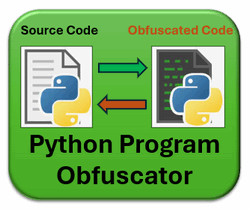

**Program Design Purpose**: The project main objective is to develop a multiplatform Python program obfuscation tool which can easily safeguard the source code for the people who wants to protect their intellectual property rights or manage their software  sensitive algorithm.  This tool will seamlessly obfuscate and encode the source code into unreadable but Python-interpreter executable bytes data which can be mixed executed with normal python program. Additionally, it will offer a decoder to revert obfuscated byte data back to its original source code. The program comprises three main components:

- **Obfuscation Encoder** :  This component encrypts the Python source code, whether it's an entire file or a specific section, rendering it unreadable as bytes data, then embed an execution header to create the executable but unreadable python program/section.
- **Obfuscation Decoder** : The decoder is designed to reverse the encoding process, this decoder transforms obfuscated bytes data back into its original Python code, ensuring ease of readability and accessibility.
- **Service Web Interface** : Provide a user-friendly web interface for the user to easily encoding and decoding of Python programs. 

The usage example of the program obfuscation tool is shown below, the user can use encoder to obfuscate the one line code `print("hello world")` to unreadable code bytes, then use the decoder to covert it back:  

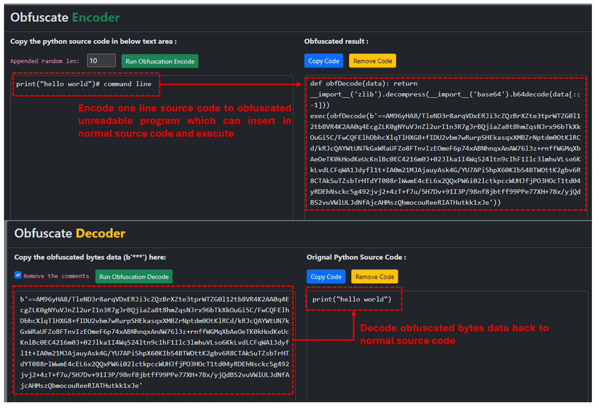

We also provide the Python-API for user to integrated the encoding and real-time decoding & execution function into their program. Video to show the detail usage : [link](https://youtu.be/2vG-mqkGg_4?si=keG-J5XppWxbxhtY)

```
# Created:     2024/03/21
# Copyright:   Copyright (c) 2024 LiuYuancheng
# License:     MIT License
```

**Table of Contents**

[TOC]

- [Python Program Obfuscator](#python-program-obfuscator)
    + [Introduction](#introduction)
        * [Obfuscation Encoder Web UI](#obfuscation-encoder-web-ui)
        * [Obfuscation Decoder Web UI](#obfuscation-decoder-web-ui)
    + [Background Knowledge](#background-knowledge)
    + [Project Design](#project-design)
        * [Design of Encoding and Decoding](#design-of-encoding-and-decoding)
    + [Program Setup](#program-setup)
        * [Development Environment](#development-environment)
        * [Additional Lib/Software Need](#additional-lib-software-need)
        * [Hardware Needed : None](#hardware-needed---none)
        * [Program Files List](#program-files-list)
    + [Program Usage/Execution](#program-usage-execution)
      - [Run the obfuscator via command interface](#run-the-obfuscator-via-command-interface)
      - [Run the obfuscator via web interface](#run-the-obfuscator-via-web-interface)
    + [Reference](#reference)
    + [Problem and Solution](#problem-and-solution)

------

### Introduction 

Program obfuscation is a widely adopted common technique for enhancing the security of Python applications. There are various obfuscation libraries and tools exist in the market, such as [pyarm](https://pyarmor.readthedocs.io/en/latest/) or [free online tool's obfuscation tool](https://freecodingtools.org/py-obfuscator). The obfuscation process will employ methods such as `identifier renaming`, `code encryption`, `code packing`,  `dead code insertion` and so on, it effectively makes it difficult for hackers to understand the program execution/control flow and safeguards sensitive source code from unauthorized access. But most of the current obfuscation tools don't provide the features like `decoding algorithms`, `customization of obfuscation result size` , or the `selection of whether obfuscate entire/part of file`.

Inspired by the concept of this [free online tool's obfuscation tool](https://freecodingtools.org/py-obfuscator), our goal is to develop a web-based Python program obfuscation tool with the following key features:

- Provide multi-layer Python code obfuscation with customizable encoded obfuscated code sizes configuration.
- Provide provision of both encoder and decoder functions to facilitate maintenance and debugging of obfuscated code.
- Provide capability to obfuscate entire Python programs or specific sections of source code for added flexibility.
- Integration of flexible code randomization techniques to ensure that each generated obfuscated code is unique, even when derived from the same source code.
- Provision of a standardized API for users to seamlessly integrate the tool into their projects, coupled with a user-friendly Web UI for convenient encoding and decoding operations.

The obfuscation tool work flow is shown below:

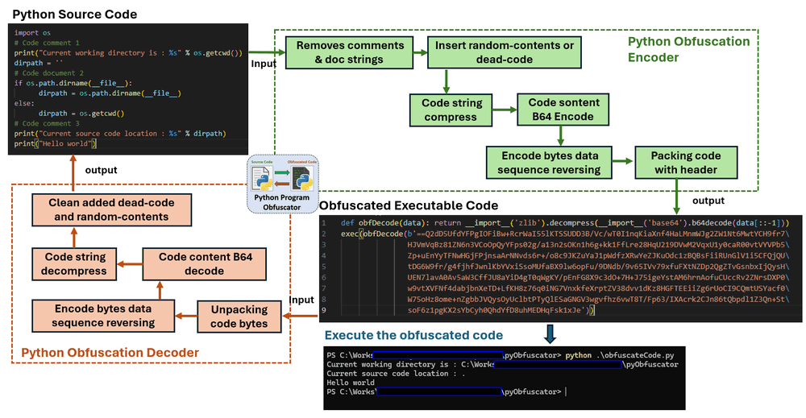

`version v0.1.2`

##### Obfuscation Encoder Web UI

The Obfuscate Encoder page is shown below. To obfuscate a Python function or program, simply paste the Python source code into the source code text field, then select the random contents append config parameter `randomLen` (ranging from 0 to 100). Each line of source code will be appended `randomLen` * 16 Bytes random sting before do the obfuscation encoding process. 

> Obfuscation encoder web page view : 

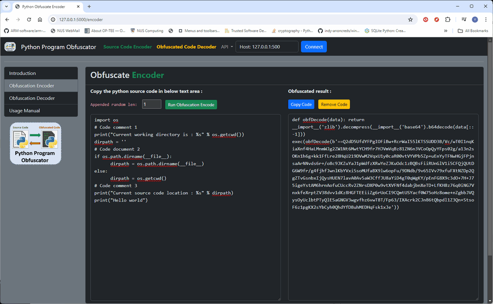

Upon pressing the "Run Obfuscation Encode" button, the obfuscated code will appear in the result text field on the right. Press the copy code button then paste the obfuscated code to your program to execute.

>  Note : Each time the user presses the run button, a different obfuscated code result will be generated.


##### Obfuscation Decoder Web UI

Similar to the encoder page, the decoder page is displayed below. Users are required to copy the byte data of the obfuscated code (contained within the `exec()` function) into the left text field. Then, by clicking the "Run Decoder" button, the obfuscated code will be converted back to its original source code.

> Obfuscation decoder web page view : 

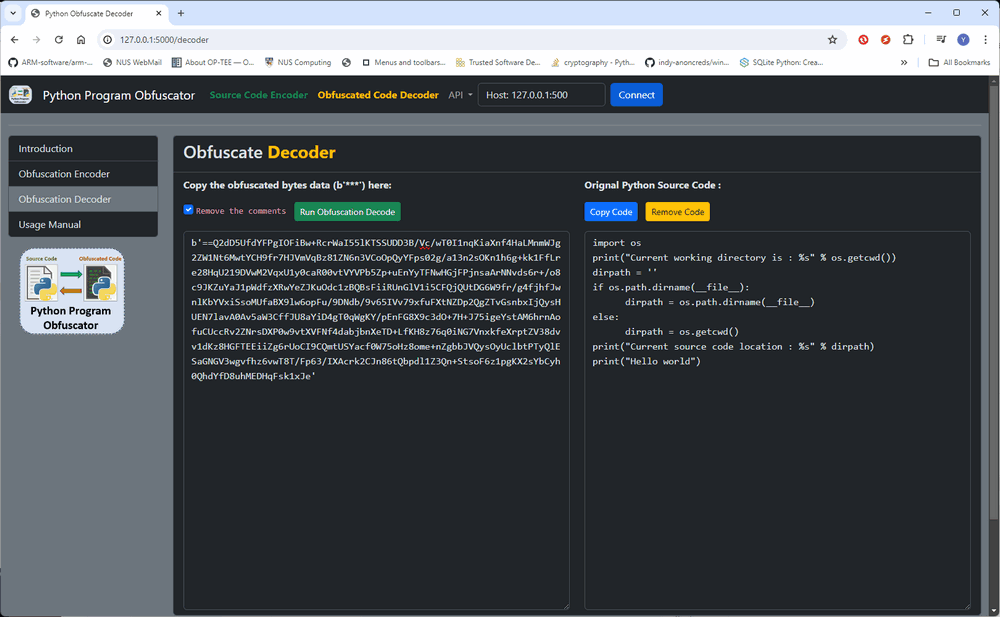

> Note: If users prefer to obtain the source code without comments, they can check the "Remove the comments" checkbox.


------

### Background Knowledge

**What is Program obfuscation ?** 

Program obfuscation is a technique used in software development to deliberately make the source code of a program more difficult to understand or reverse-engineer, while preserving its functionality. It is commonly employed in scenarios where the developer wants to protect their intellectual property, prevent unauthorized access, or hinder attempts to tamper with the software.

Here are some common techniques used in program obfuscation:

1. **Renaming identifiers**: This involves renaming variables, functions, classes, and other identifiers in the code to non-descriptive or cryptic names. For example, variables like `userInput` might be renamed to `a` or `b`, making it harder to understand their purpose.
2. **Control flow obfuscation**: This technique involves altering the flow of control in the program, making it harder to follow the logical structure. This can be achieved through techniques such as adding redundant code, using conditional statements in unusual ways, or restructuring loops.
3. **Data obfuscation**: Data obfuscation involves disguising data within the program, making it harder to understand or extract sensitive information. This can include encrypting strings or splitting them into smaller parts that are concatenated at runtime.
4. **Code encryption**: This involves encrypting some or all of the code in the program and decrypting it at runtime. This makes it difficult for attackers to analyze the code without knowing the decryption key.
5. **Dead code insertion**: Inserting dead code (code that is never executed) into the program can confuse reverse engineers and make it harder to understand the true functionality of the program.
6. **Code packing**: This involves compressing or packing the executable file, making it harder to analyze using standard tools. The packed code is typically decompressed and executed at runtime.
7. **Anti-debugging techniques**: These are methods used to detect and prevent the program from being debugged, which can make it harder for attackers to analyze the code.

It's important to note that while obfuscation can make reverse engineering more difficult, it's not a foolproof method for protecting software. Skilled attackers may still be able to reverse engineer obfuscated code given enough time and resources. Therefore, obfuscation is often used in conjunction with other security measures such as encryption, access control, and code signing. Additionally, obfuscated code can be harder to maintain and debug, so developers should weigh the benefits against the potential drawbacks before applying obfuscation techniques.


------

### Project Design

This section integrates with the background knowledge to elucidate the steps and techniques applied in the obfuscation process.

##### Design of Encoding and Decoding  

As depicted in the program workflow diagram provided in the introduction, the Python source code section undergoes encoding through a series of steps to convert the Python source code string into bytes data. Subsequently, it is encapsulated with a decode header. To execute the bytes data, the decode header is utilized to convert the bytes back into a string, which is then passed into the Python dynamic code execution function `exec()` for code execution. The encoding steps are outlined below:

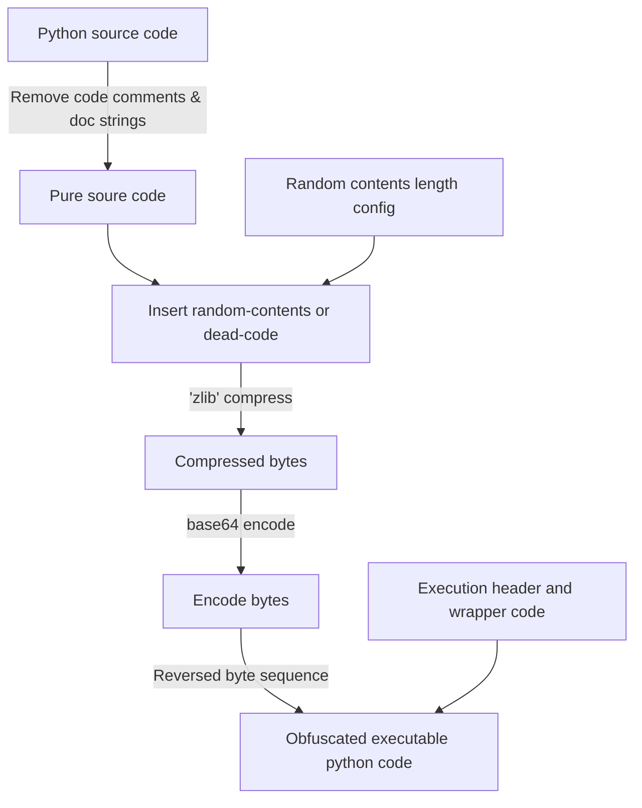

Example encoder source code input : 

```python
import os
# Code comment 1
print("Current working directory is : %s" % os.getcwd())
dirpath = ''
# Code document 2
if os.path.dirname(__file__):
      dirpath = os.path.dirname(__file__)
else:
      dirpath = os.getcwd()
# Code comment 3
print("Current source code location : %s" % dirpath)
print("Hello world")
```

Example encoder obfuscated code output: 

```python
def obfDecode(data): return __import__('zlib').decompress(__import__('base64').b64decode(data[::-1]))
exec(obfDecode(b'kDMA2910OfmOY0xz1Jeq1cjF1JMlFPYhZCtLm5r5V0c3LyNFMwBmnV7YF3hnto2YOMsfrKkvLSzKTp1tL3je1dP+R8t2mH74DVtheP0G1EUMVMnsRP3APWbRcAfFkilrWTbnlp3ttZVjhXcluBz5GOMb/UlK2UKJRzbbUXHe7DKL65v/y/trHOP3hfqE83kkRwle1v6OSgbVVAT7CZvvXGXWa6u6wBXjGgHPV02VULPoNfXFUXRCUxN11+ZFIxbON+t67wffylf9V3/xKJxHbe96nWPH/3aBwKW0e9GFl5DlK4zJUCSNqnhxlGpiCVNIKCHTC2uuOvPgUNLjQXiOJWJbRbEnW/YfrDQrsX9eUPX+tT4w6hx10UIIG2U7zcC2maRyDUhYcjeEeMOVjqHUR/aZTjtcVuOJ0GjIzrjqdau0yCup99y2Hov6/TZyKf/JPXmd1M+6IMyrPBpVuw8uBVYW72TRSDh1o1F2OuFvl05d1HhzjFYOuiuSqq+58tbop9aXeMV/lzj02klznW10GVcXSYESwFoLEcLoStyQaVw72AYC9UNEqEhvYgvGJizlmu1QsDmIhOcq1M3ViI2UV9/6Hrf55PtrZWqMfX0CF3YFPWI20OQmE4FjWKTHwduZ+wMzweDKqrBNbhWwj6GL6srBRXvVZvVAiyV+WNUAs8n3u/uPlbv7u/Ok6/4vU9jPP+1Dyme57KhvsRITjAGw1AakCa8M+oVb7C7IZ0pRFn8xyVdXmJRlRwoduC6hR/cuwBZUHCjScdDhB4I0G81XqP+/PIvAGmFho19mLzJCyZ94+m1k7trz3/QUzBQ0h0oJhbaeEOhzrBm15OrFoXuiATAG3TpdTH0Jqud75vO/97ffXQsSeG7Az9GP55p5moVcW4AZxQt+3pDQtfJeYVwSU3kh6jJNyuApFffdvFQdytMKCJGO9OLnjnWf+fPe3uvPzFO852U+Vnu58HP/pX+8P3+6nT/tukz8xX+x2X/2zH123+6pV7O/4Lf7Ln+492o77mrhGcdXegy4lyiNQJnIiRrIqRx9Vf+eJTdEbR0B1yoxwskbtt7SYIWLoujaBPnJYb+oGzH+5/wDvmN5rd68rP9g1gmsgROkfKzZgg/k0ZjoPgwZmWzkwtXgZCngFcnu1eKchFyUMpbHjJgR3QGnL6IKemRn6JX/+4Lf2X/yhXe0ff0RK9Hc5urkwNBs3d02Jz4ZmO9Mmw5roHzbmIvsZUSVKlKGejtxGfYeNcfhMcEXK2Ml1xJe'))
```

The obfuscation technique used in the obfuscation encoding process: 

1. **Bytes reversal**: The result data bytes array are reversed to make reversed code harder to understand at a glance and requires reversing it before interpreting it correctly.
2. **Randomization**: The encode function adds a random string of specified length to each line before obfuscation. This adds further complexity and randomness to the obfuscated code.
3. **Dynamic import**: The obfuscated code uses `__import__()` to dynamically import modules (`zlib` and `base64`). This technique hides the imports, making it less obvious what modules are being used.
4. **String manipulation**: The encode process  removes comments, static strings and empty lines from the code to make the code becomes more difficult to understand and analyze.
5. **Encoding and compression**: The encode function obfuscates the code by encoding it with base64 and compressing it with `zlib`. Additionally, it reverses the resulting string. This process makes the code unreadable in its encoded form.
6. **Execution via `exec()`**: The code is executed by `exec()` function. This method of execution makes it challenging to understand the code's behavior without analyzing its execution.

These obfuscation techniques make the code difficult to understand, analyze, and reverse engineer, enhancing its resistance to reverse engineering and unauthorized access.

The decoding progress reverse the encoding process with below steps:

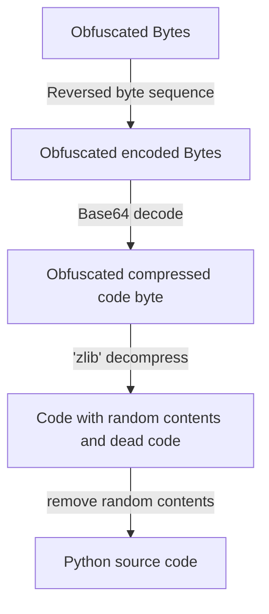

Example decoder obfuscated bytes input : 

```python
b'==Azg/E+Hk/eC9JOcaYt02SskKCJHfYu6ZVAPyhHdaUjsOse30tA1QP7d3nvW7U4eWbcNtHxmP4jG6VKRiMCbBNe1/8UHBxw7WSMdLdeA6vnz07MBSDeOxNd91GOps8hieqUrq+9QO8BIrlwh1me8uwTqOvK7qNLgbc/bAsiysVCPPfoDwOxAE+YpjwxPvGPaBCdTP2QWyRuO36o4GRlaf8NtENhd5Uzcz6VcBntUaz73kkqyNxjXKCvrqFH2Cy5pc12ydzjuIS2p2ERKLy1IA0LZdHllai3el3/e4VY40KhjXeZkjmtgMmJxAyQ4wDgWPWqXiNfywoHb2OWVBA442CkfaqknK/aDE4exCL2PGERtupfoaVAgikXMR/ZdA2NkxKhO19JWowZYU0I8GSzd7mwOI6S+6C8r4ZwVAj12P+t5OUnvkVvx1lxRGXFxyh8FaFglYml1iilkUBzBrsTI24q2VgoCr5bA1nvSNdY8hbXvZBRS05i9YWwlQGzbgB15Qlcnh6Wb0aYxUVMrT58MYXngucLlVZVvACQdIr2YTFBjwlN5aslybv/Pf/zeML/+4zvjs9x1v+P+97fe8rP+9867fe++3v++fuO6uloQpnGAp9n2CEh7cmhi43pvoPpZK5ThFO7GeeRQETHqtkk1xJe'
```

Example decoder source code output:

```python
print("hello world")
```


------

### Program Setup

Follow the below configuration steps before run the program.

##### Development Environment

- python 3.8.2rc2+ [Windows11]

##### Additional Lib/Software Need

- Flask: https://flask.palletsprojects.com/en/3.0.x/ , install `pip install Flask`
- Flask-SocketIO: https://flask-socketio.readthedocs.io/en/latest/ , install `pip install Flask-SocketIO`

##### Hardware Needed : None

##### Program Files List 

| Program File           | Execution Env | Description                                                  |
| ---------------------- | ------------- | ------------------------------------------------------------ |
| src/pyObfuscator.py    | python 3.7 +  | The main lib module to provide the obfuscation encode and decode functions. |
| src/pyObfuscatorApp.py | python 3.7 +  | The obfuscate web interface.                                 |
| templates/*.html       |               | All the web page html files.                                 |


------

### Program Usage/Execution

We offer two interfaces for users to utilize the program: a console command interface and a web interface. 

#### Run the obfuscator via command interface

**Step1**: Run the  program via command: 

```
python pyObfuscator.py
```

**Step2**: Select mode 0, then follow the steps to input the python program need to be obfuscate, the obfuscated code will be saved in file `obfuscateCode.py` , then user can change the file's name and replace the original file.

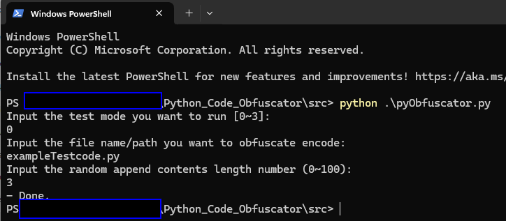


#### Run the obfuscator via web interface 

**Step1**: Run the web host program via command: 

```
python pyObfuscatorApp.py
```

**Step2**: Open browser type in the URL: http://127.0.0.1:5000/

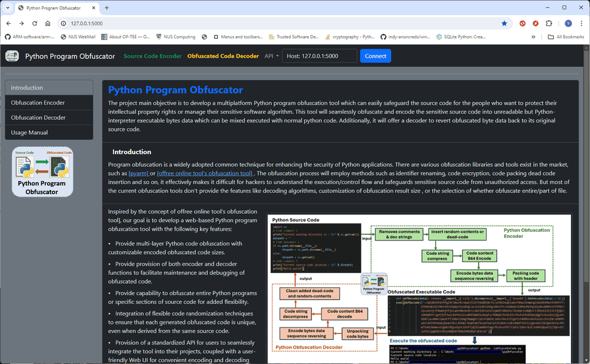

**Step3**: Select the `Obfuscation Encoder` from the left guide menu, and follow the below steps to obfuscate the source code:

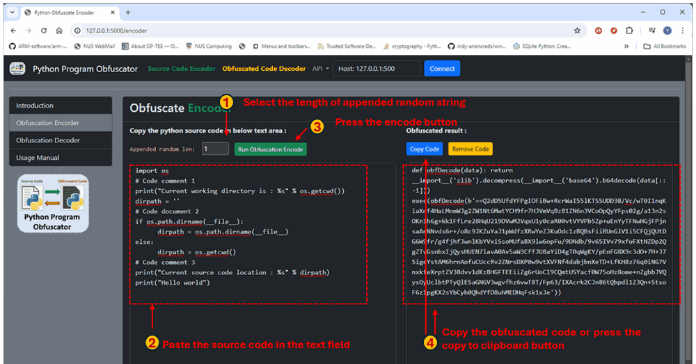

**Step4**: Select the `Obfuscation decoder` from the left guide menu, and follow the below steps to get the source code:

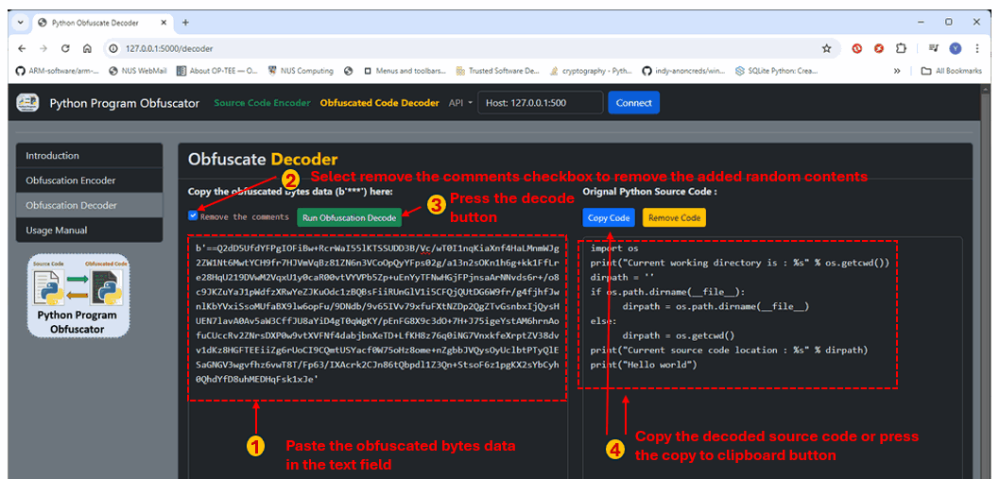


------

### Reference 

- **pyarm**: https://pyarmor.readthedocs.io/en/latest/ 

- **free online tool's obfuscation tool**: https://freecodingtools.org/py-obfuscator


------

### Problem and Solution

Refer to `doc/ProblemAndSolution.md`

------

> Last edit by LiuYuancheng(liu_yuan_cheng@hotmail.com) at 21/03/2024, if you have any problem please free to message me.