# SpyTrojan Emulator

**Program design purpose :** We want to create a spy trojan emulation program which can be integrated in our RTC2 Emulation system, so one/multiple red team hackers/attackers can remote monitor multiple victim hosts' user action ( logging keyboard event, take desktop screen shot) and do same malicious action (run commands, inject other malware, scan the network, ssh / scp / port forward to other victims...). This program will be used for the [Lock Shield 2024](https://ccdcoe.org/exercises/locked-shields/) Cyber Exercise DFIR ( digital forensics and incident response ) section.

[TOC]

------

### Introduction 

This Spy-Trojan is a inheritance class of the [RTC2 Emulation System](https://github.com/LiuYuancheng/Python_Malwares_Repo/tree/main/src/c2Emulator) standard backdoor trojan example `<backdoorTrojan.py>` with added the below special functions:

- Keyboard event logging and user keyboard type in simulation from User Emulator Project `keyEventActor.py`  [source code](https://github.com/LiuYuancheng/Windows_User_Simulator/blob/main/src/actionScheduler/UtilsFunc/keyEventActors.py)
- Network Scanning function from User Emulator Project lib `nmapUtils.py` [source code](https://github.com/LiuYuancheng/Windows_User_Simulator/blob/main/src/lib/nmapUtils.py)
- SSH login and run cmd, SCP file copy and port forwarding from SSHconnecor lib [project link](https://github.com/LiuYuancheng/SSH-connector)
- User desktop screen shot function. 

The general function such as remote execute cmd, file steal/injection, mouse lock, please refer to the RTC2 Emulation backdoor trojan document. 

The red team hackers/attackers will use the User Emulator Profile framework to simulate one/multiple hackers give different instruction to 4 malware which running in 4 victim nodes ( OT maintenance engineer, company officer, HQ operator and IT support engineer) to do different malicious action at different time. All the action are driven by the hacker's profile.

> User emulation project : [Github Repo link](https://github.com/LiuYuancheng/Windows_User_Simulator)

The whole system work flow is shown below:

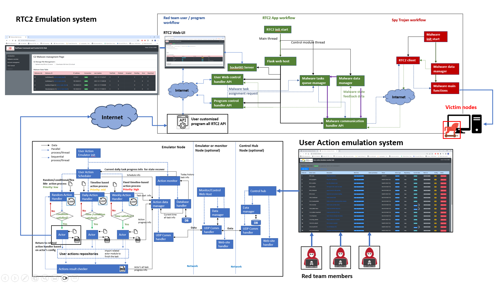

`version v0.2.2`

Main program time line: 

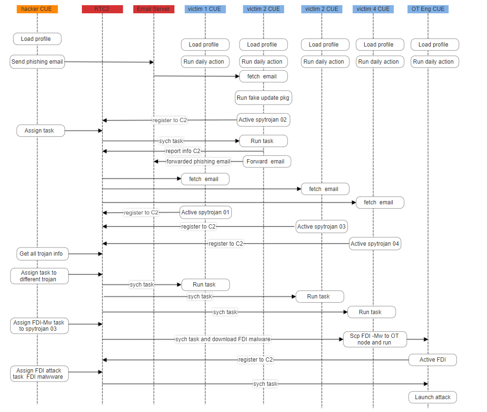

[version v0.1](https://app.smartdraw.com/editor.aspx?templateId=d43ce678-8d07-43c8-85c2-7b317f7d580d&flags=128#depoId=53507608&credID=-58419825)

Introduction to FDI/FCI injector program: [link](https://github.com/LiuYuancheng/Python_Malwares_Repo/blob/main/src/falseCmdInjector/readme.md)

------

### Background knowledge

Different between backdoor Trojan and Spy Trojan: 

Backdoor Trojans and Spy Trojans are both types of Trojan horses, which are malicious software that disguises itself as legitimate or benign to deceive users into executing them. However, they serve different purposes and have distinct functionalities:

##### Backdoor Trojan

- **Functionality:** A Backdoor Trojan, as the name suggests, creates a secret entry point (backdoor) into the infected system, allowing unauthorized access and control.
- **Objective:** The primary goal of a Backdoor Trojan is to provide remote access to the attacker, enabling them to perform various malicious activities without the user's knowledge.
- **Capabilities**:
  - Opening a network port for communication.
  - Uploading and downloading files.
  - Executing commands remotely.
  - Installing additional malware.
- **Risk:** Backdoor Trojans pose a significant security risk as they can give attackers persistent access to the compromised system, leading to data theft, system manipulation, or further exploitation.

##### Spy Trojan

- **Functionality:** A Spy Trojan is designed to monitor and collect sensitive information from the infected system without the user's awareness.
- **Objective:** The primary goal of a Spy Trojan is to steal valuable data, such as login credentials, personal information, financial details, or other sensitive data.
- Capabilities:
  - Keylogging: Recording keystrokes to capture passwords and other text input.
  - Screen capture: Taking screenshots to capture sensitive information displayed on the screen.
  - Clipboard capture: Collecting data copied to the clipboard.
  - Webcam or microphone surveillance: Monitoring audio and video inputs.
- **Risk:** Spy Trojans are a significant privacy and security threat as they can lead to identity theft, unauthorized access to accounts, or the compromise of confidential information.


------

### Program Setup

Development/Execution Environment : python 3.7.4+

Additional Lib/Software Need : 

- keyboard 0.13.5 : https://pypi.org/project/keyboard/
- pyscreenshot 3.1 : https://pypi.org/project/pyscreenshot/

##### Program Files List

| Program File              | Execution Env | Description                                                  |
| ------------------------- | ------------- | ------------------------------------------------------------ |
| spyTrojan.py              | python 3      | This spy trojan emulation malware is modified from the backdoor trojan program <backdoorTrojan.py> by adding the network scanning function, use keyboard logging function and use desktop screen shot function. |
| ConfigLoader.py           | python 3      | lib file : Configuration file loader                         |
| c2Client.py               | python 3      | lib file : C2 server communication file                      |
| c2MwUtils.py              | python 3      | lib file : malware data storage module                       |
| keyEventActors.py         | python 3      | lib file : keyboard event generate and handling module       |
| nmapUtils.py              | python 3      | lib file : nmap tool wrapper to scan the network             |
| spyTrojanCfg_template.txt |               | config file                                                  |


------

### Program Usage 

Set the config file base on your RTC2 server (rename the `spyTrojanCfg_template.txt` to `spyTrojanCfg.txt` ): 

Run the spy trojan to connect to the RTC2 server: 

```
python spyTrojan.py
```

Check whether the false data injector registered on C2:

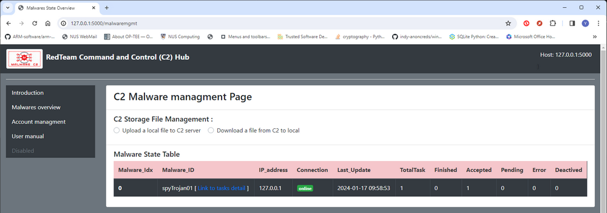


##### 1.Run command on victim machine 

- Refer to RTC2 Emulation system document section [Assign Command Execution Task to Malicious-Action-Program](https://github.com/LiuYuancheng/Python_Malwares_Repo/blob/main/src/c2Emulator/readme.md)


##### 2.Steal a critical file from victim machine

- Refer to RTC2 Emulation system document section [Copy File From the Victim Machine to RTC2-Hub](https://github.com/LiuYuancheng/Python_Malwares_Repo/blob/main/src/c2Emulator/readme.md)


##### 3.Inject another malware/file to the victim machine 

- Refer to RTC2 Emulation system document section [Inject file from C2 to target victim machine ](https://github.com/LiuYuancheng/Python_Malwares_Repo/blob/main/src/c2Emulator/readme.md)


##### 4.Scan the victim subnet to find all the host IP addresses

Select the related Spy-Trojan (we use spytrojan01 as example) page, check the **Assign a special task via Json**, then fill in the task detail : 

- TaskType: `scanSubnet`
- Repeat: `int <number of the injection repeat times>`
- Tasks data: `<subnet string> example:172.25.121.0/24 `

Assign task from Web-UI (press submit button) : 

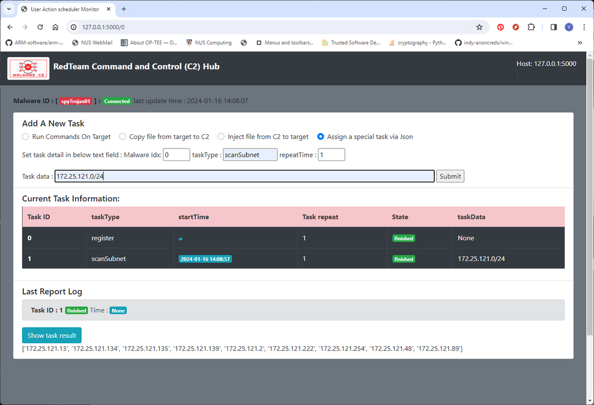

After the task executed (state change to finish) , click the show task result to list all the IP addresses in the scanned subnet. 

Assign task Via HTTP POST request: 

```
http://<RTC2-Hub ip address >:<port>/addnewtask, json={"malwareID": <ID>, "taskType": "scanSubnet", "taskdata": <task detail infomration json data> }

Example: 
requests.get(http://127.0.0.1:5000/addnewtask, 
json={"malwareID':"spyTrojan01","taskType":"scanSubnet","taskdata":"172.25.121.0/24" })
```


##### 5.Logging User Keyboard Input for time interval

Select the related Spy-Trojan (we use spytrojan01 as example) page, check the **Assign a special task via Json**, then fill in the task detail : 

- TaskType: `keyEvent`
- Repeat: `1`
- Tasks data: `startRcd;<record time interval in Sec> example:startRcd;10 ` If the interval < 0, Spy-Trojan will keep logging  until received the keyboard logging stop task. 

Assign task from Web-UI : 

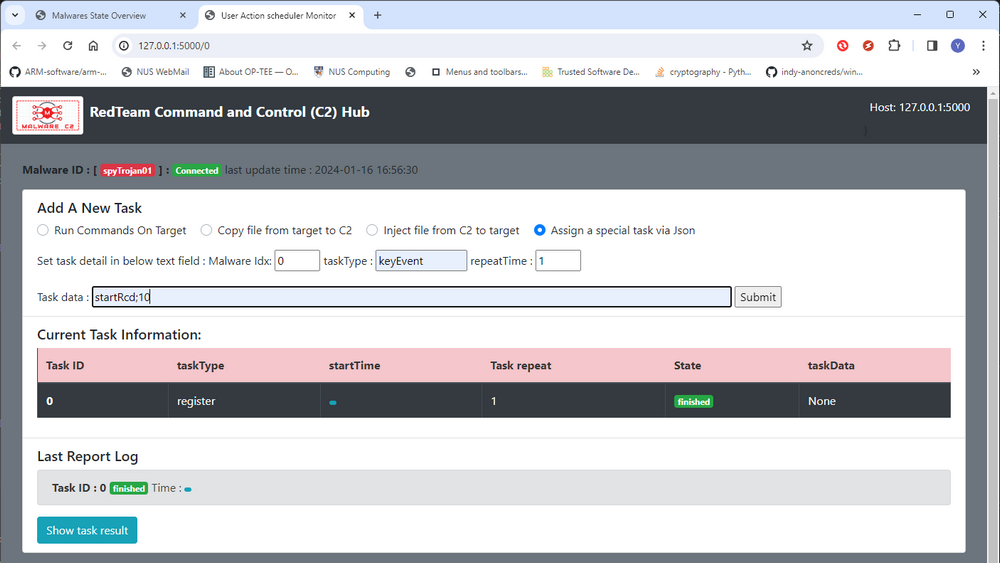

The key logging function is running parallel with the main thread, red team hacker can assign other task during the keyboard logging process.

Assign task Via HTTP POST request: 

```
http://<RTC2-Hub ip address >:<port>/addnewtask, json={"malwareID": <ID>, "taskType": "keyEvent", "taskdata": <task detail infomration json data> }

Example: 
requests.get(http://127.0.0.1:5000/addnewtask, 
json={"malwareID':"spyTrojan01","taskType":"keyEvent","taskdata":"startRcd;10" })
```


##### 6.Get the Keyboard Logging data (simple string)

Select the related Spy-Trojan (we use spytrojan01 as example) page, check the **Assign a special task via Json**, then fill in the task detail : 

- TaskType: `keyEvent`
- Repeat: `1`
- Tasks data: `getEvent;simple`

Assign task from Web-UI :

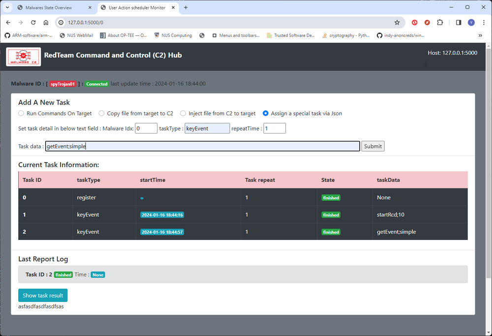

After the task finished, click the show task result button to check the logged keyboard string in the last record period.

Assign task Via HTTP POST request: 

```
http://<RTC2-Hub ip address >:<port>/addnewtask, json={"malwareID": <ID>, "taskType": "keyEvent", "taskdata": "getEven;Simple" }

Example: 
requests.get(http://127.0.0.1:5000/addnewtask, 
json={"malwareID':"spyTrojan01","taskType":"keyEvent","taskdata":"getEvent;simple" })
```


##### 7.Get the Keyboard Logging data (Detailed keyboard event)

If you want to check all the keyboard event detail such  key press time, release time, combined keys and whether the event from a virtual keypad, select the related Spy-Trojan (we use spytrojan01 as example) page, check the **Assign a special task via Json**, then fill in the task detail : 

- TaskType: `keyEvent`
- Repeat: `1`
- Tasks data: `getEvent;detail`

Assign task from Web-UI :

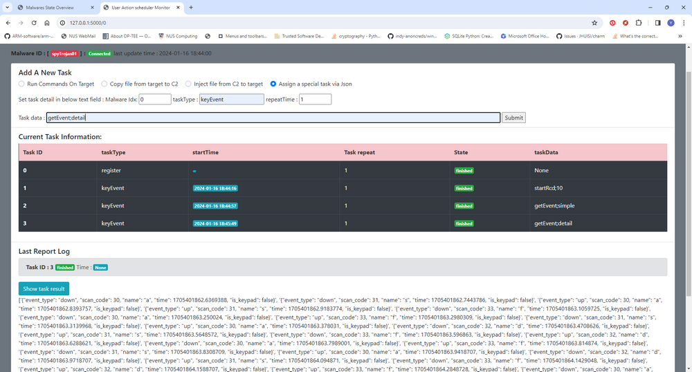

After the task finished, click the show task result to check the logged keyboard action details in the last record period.

The key event json example: 

```
{"event_type": "down", 
"scan_code": 30, 
"name": "a", 
"time": 1705401862.6369388, 
"is_keypad": false}
```

Assign task Via HTTP POST request: 

```
http://<RTC2-Hub ip address >:<port>/addnewtask, json={"malwareID": <ID>, "taskType": "keyEvent", "taskdata": "getEvent;detail" }

Example: 
requests.get(http://127.0.0.1:5000/addnewtask, 
json={"malwareID':"spyTrojan01","taskType":"keyEvent","taskdata":"getEvent;detail" })
```


##### 8.Stop Current Key Logging (+ save log in file)

To force stopping a running keylogging task, select the related Spy-Trojan (we use spytrojan01 as example) page, check the **Assign a special task via Json**, then fill in the task detail : 

- TaskType: `keyEvent`
- Repeat: `1`
- Tasks data: `stopRcd;None` (Just stop the keyboard logging). 

Just stop keyboard logging progress 

Assign task from Web-UI : 

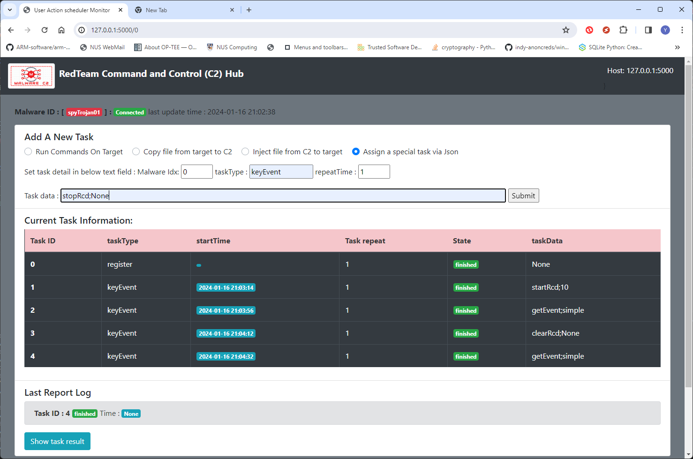

Stop and save the keyboard log to a file in the victim local folder.

Tasks data: `stopRcd;<filename> example:stopRcd;keyrecord.log `

Assign task from Web-UI:

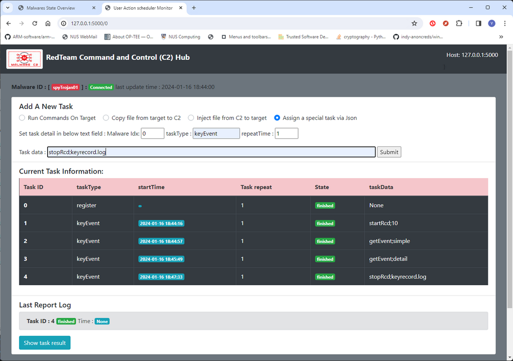

After the task finished, a keyboard event record file will be created in the victim's local folder, hacker can also use the file upload API to transfer it from victim to RTC2 hub, the record will be json format as shown below :

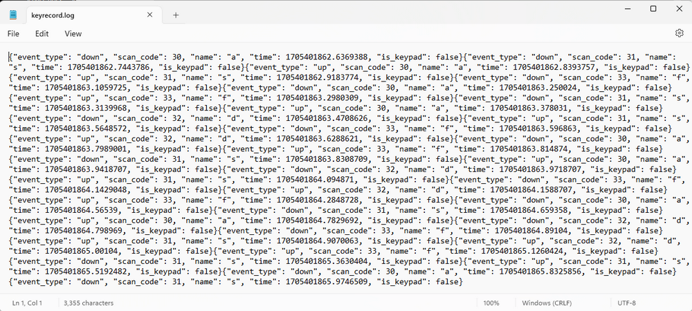


Assign task Via HTTP POST request: 

```
http://<RTC2-Hub ip address >:<port>/addnewtask, json={"malwareID": <ID>, "taskType": "keyEvent", "taskdata": "stopRcd;<paramter>" }

Example: 
requests.get(http://127.0.0.1:5000/addnewtask, json={"malwareID':"spyTrojan01","taskType":"keyEvent","taskdata":"stopRcd;keyrecord.log" })
```


##### 9.Simualte user type in data via keyboard

If you want to simulate user type in data via keyboard, select the related Spy-Trojan (we use spytrojan01 as example) page, check the **Assign a special task via Json**, then fill in the task detail : 

- TaskType: `keyEvent`
- Repeat: `1`
- Tasks data: `typeInStr;<inputString>` 

Assign task from Web-UI (Assume we want to type in helloworld! ) :

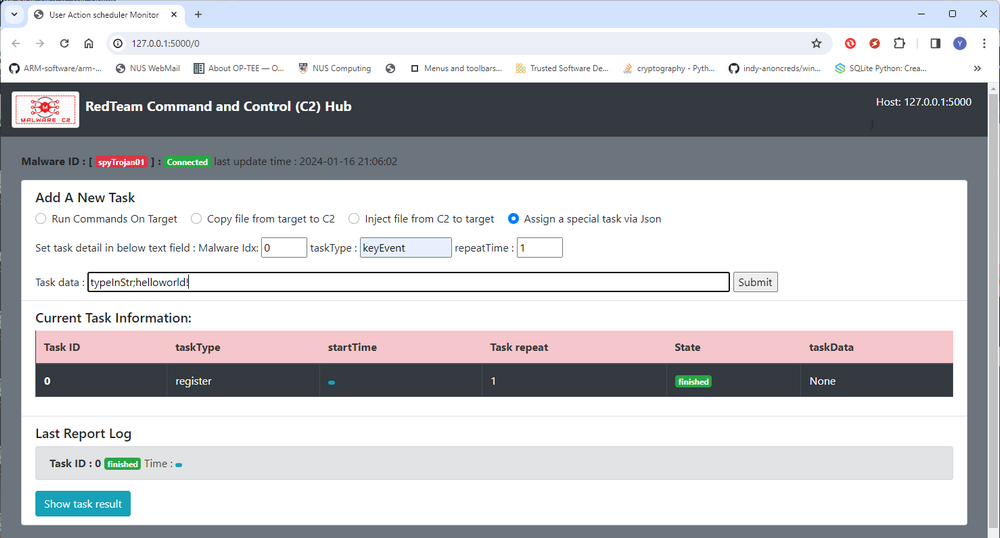


When the task shows "running", on the victim node side if the victim user select any text field, you can see the string will be type in (In below example, if victim user open a note file, the string will be type in to the file)

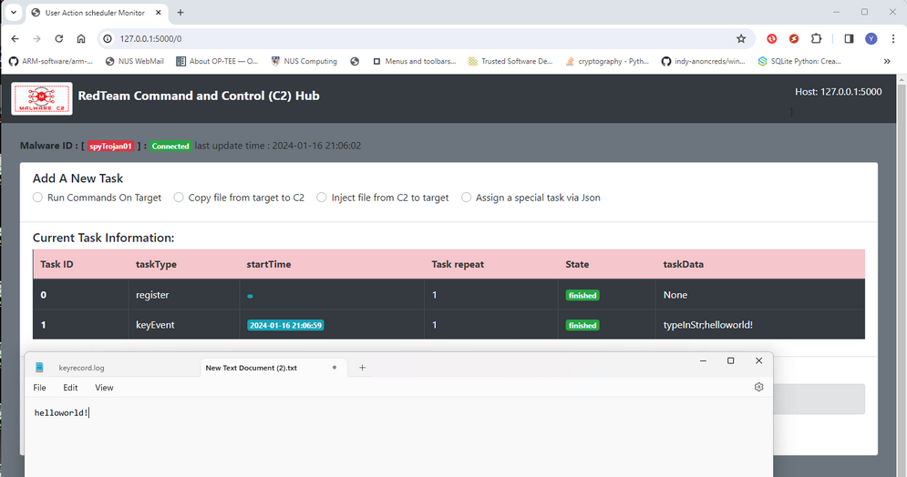


Assign task Via HTTP POST request: 

```
http://<RTC2-Hub ip address >:<port>/addnewtask, json={"malwareID": <ID>, "taskType": "keyEvent", "taskdata": "typeInStr;<inputString>" }

Example: 
requests.get(http://127.0.0.1:5000/addnewtask, json={"malwareID':"spyTrojan01","taskType":"keyEvent","taskdata":"typeInStr;helloworld!" })
```


##### 10.Screen shot current desktop and upload to RTC2

If you want to screen shot the current user's desktop, select the related Spy-Trojan (we use spytrojan01 as example) page, check the **Assign a special task via Json**, then fill in the task detail : 

- TaskType: `screenShot`
- Repeat: `1`
- Tasks data: `None or image file name` 

Assign task from Web-UI : 

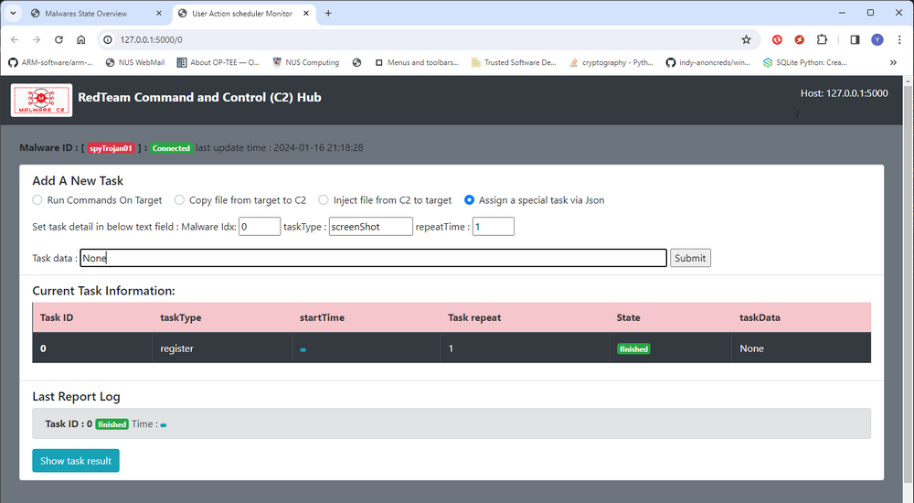


If the victim node's OS is a desktop version OS and can do the screen capture, the result will show the file name and upload state:

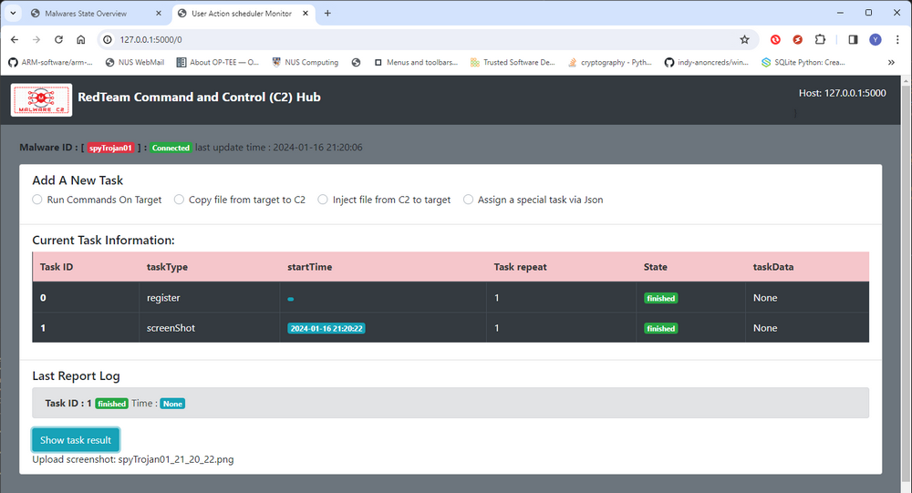

Hacker can go to the management page to download the screen shot file:

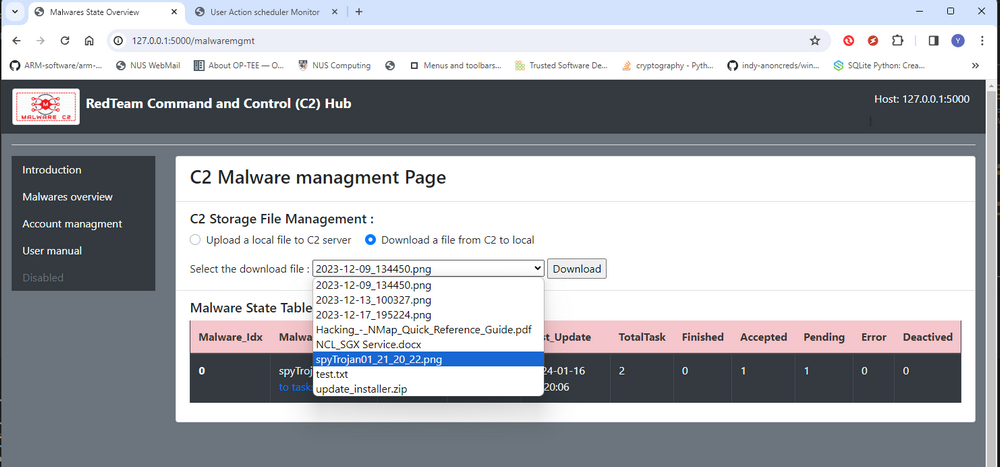


Assign task Via HTTP POST request: 

```
http://<RTC2-Hub ip address >:<port>/addnewtask, json={"malwareID": <ID>, "taskType": "screenShot", "taskdata": "None" }

Example: 
requests.get(http://127.0.0.1:5000/addnewtask, json={"malwareID':"spyTrojan01","taskType":"screenShot","taskdata":"None" })
```


##### 11.SSH login a host (or multi host ssh tunnel) , run cmd and get reuslt 

- [ ] ToDo: When Rose learned how to use lib [SSHconnector.py](https://github.com/LiuYuancheng/SSH-connector/blob/main/src/SSHconnector.py), assign this task to her.


##### 12.SSH login a host (or multi host ssh tunnel) , scp the file

- [ ] ToDo: When Rose learned how to use lib [SCPconnector.py](https://github.com/LiuYuancheng/SSH-connector/blob/main/src/SCPconnector.py), assign this task to her.


##### 13.SSH login a host (or multi host ssh tunnel)  , fowared a website in the subnet to victim

- [ ] ToDo: When Rose learned how to use lib [SSHforwarder.py](https://github.com/LiuYuancheng/SSH-connector/blob/main/src/SSHforwarder.py), assign this task to her.


------

#### Problem and Solution

Refer to `doc/ProblemAndSolution.md`


Capture the packet to file. If applied the filter, only capture the 

​      packet which match the fileter.

------

>  Last edit by LiuYuancheng (liu_yuan_cheng@hotmail.com) at 16/01/2024, if you have any problem please free to message me.